# Chapter 1: Streamlit Application Framework

Welcome to the Edunet_Voice2Text tutorial! In this chapter, we'll start our journey by understanding the very foundation of our application: the "Streamlit Application Framework."

### What Problem Does Streamlit Solve?

Imagine you want to build a cool website application where users can upload an audio file (like a lecture recording), click a button, and then see the transcription, a summary, and even flashcards generated from it. Sounds complex, right? You'd typically need to learn web development languages like HTML (for structure), CSS (for styling), and JavaScript (for interactivity), along with a server-side language.

But what if you're a Python enthusiast and want to quickly turn your data science models or scripts into a beautiful, interactive web app without all that extra hassle? This is exactly where Streamlit shines!

**Streamlit is like your personal "blueprint and construction crew" for building interactive web pages.** It takes your regular Python code and magically transforms it into a functional web application, handling all the complex web development stuff behind the scenes. It defines how everything is displayed on the webpage, from headers and text to buttons and audio players, orchestrating the layout and appearance of all elements.

### Getting Started with Streamlit: The Core Building Blocks

At its heart, Streamlit allows you to use simple Python functions to add elements to your web application. Let's look at the basic ways our Edunet_Voice2Text app uses Streamlit to build its user interface.

#### 1. Displaying Text and Headers

The most basic thing any web app does is show information. Streamlit makes this super easy. You can use functions like `st.title()`, `st.header()`, `st.write()`, or `st.markdown()` to display text, just like you're printing it in your Python console, but now it appears on a webpage!

Our application starts with a welcoming header. In `app3.py`, we use `st.markdown()` to create a custom-styled header:

```python
# From app3.py
import streamlit as st

st.markdown("""
<div class="main-header">
    <h1>🎓 Lecture Voice-to-Notes Generator</h1>
    <p class="subtitle">Transcribe • Summarize • Study smarter with AI</p>
</div>
""", unsafe_allow_html=True)
```

**What this code does:**
The `st.markdown()` function tells Streamlit to display text formatted using Markdown (a simple way to add formatting like bold, italics, and headings) or even raw HTML. Here, we're embedding HTML to create a visually appealing title and subtitle for our application. The `unsafe_allow_html=True` part is necessary when you want to use raw HTML within `st.markdown()`.

**What you see:**
When you run the app, the very first thing you'll see is a large, colored box at the top with "🎓 Lecture Voice-to-Notes Generator" and its subtitle.

#### 2. Adding Interactive Widgets

A web application isn't just about showing text; it's about interacting with the user. Streamlit provides "widgets" for this – things like buttons, sliders, text input fields, and file uploaders.

In our app, we need users to be able to upload an audio file. Streamlit's `st.file_uploader()` widget handles this:

```python
# From app3.py (simplified)
import streamlit as st

st.markdown('<div class="custom-card"><b>📁 File Upload</b><br>WAV, MP3, WEBM, M4A</div>', unsafe_allow_html=True)
audio_file = st.file_uploader("Upload audio...", type=["wav", "mp3", "webm", "m4a"], key="uploader")

if audio_file:
    st.success("✅ File uploaded!")
    # ... further processing will happen here ...
```

**What this code does:**
`st.file_uploader()` creates a button that, when clicked, opens a file browsing window for the user. It also specifies which file types (like `.wav`, `.mp3`) are allowed. If the user uploads a file, the `audio_file` variable will contain information about that file. We then show a success message.

**What you see:**
On the webpage, there will be a section titled "File Upload" with a clickable area that says "Upload audio...". After a file is selected, a green "✅ File uploaded!" message appears.

#### 3. Structuring the Layout

Web applications often need to arrange content in columns, sidebars, or expanders to look organized. Streamlit offers functions to manage this layout.

Our app provides two ways to input audio: live recording or file upload. We want these side-by-side. We use `st.columns()` for this:

```python
# From app3.py (simplified)
import streamlit as st

col1, col2 = st.columns(2) # Create two columns

with col1: # Content inside the first column
    st.markdown('<div class="custom-card"><b>🎤 Live Recording</b><br>Record from your microphone</div>', unsafe_allow_html=True)
    # ... mic recorder widget would go here ...

with col2: # Content inside the second column
    st.markdown('<div class="custom-card"><b>📁 File Upload</b><br>WAV, MP3, WEBM, M4A</div>', unsafe_allow_html=True)
    # ... file uploader widget would go here ...
```

**What this code does:**
`st.columns(2)` creates two equal-width columns. The `with col1:` and `with col2:` blocks ensure that any Streamlit elements (like the markdown text or widgets) placed inside them appear within their respective columns on the webpage.

**What you see:**
You'll see two distinct sections arranged next to each other: one for "Live Recording" and another for "File Upload."

#### 4. Customizing Appearance (Styling)

While `st.markdown()` can take raw HTML, Streamlit also allows you to inject custom CSS (Cascading Style Sheets) to give your app a unique look and feel. CSS is what gives web elements their colors, sizes, fonts, and positions.

Our `app3.py` has a large block of CSS to make the app look modern and dark-themed:

```python
# From app3.py (simplified)
import streamlit as st

st.markdown("""
<style>
    .main-header {
        background: linear-gradient(135deg, #4a148c 0%, #1e3c72 100%);
        padding: 2rem;
        border-radius: 10px;
        text-align: center;
        color: #ffffff;
    }
    .section-header {
        font-size: 1.5rem;
        color: #e0e0e0;
        border-bottom: 3px solid #3498db;
    }
    /* ... many more CSS rules ... */
</style>
""", unsafe_allow_html=True)

# Also, configure the browser tab with st.set_page_config
st.set_page_config(
    page_title="Lecture Voice-to-Notes Generator",
    page_icon="🎓",
    layout="wide",
    initial_sidebar_state="collapsed"
)
```

**What this code does:**
*   The `st.markdown()` block injects a `<style>` tag containing CSS rules. These rules target specific "classes" (like `main-header` or `section-header`) that we've assigned to our HTML elements. For example, `.main-header` defines the background color, padding, and text color for our main app title.
*   `st.set_page_config()` is a special Streamlit function that configures the browser tab. It sets the title (`page_title`), the icon next to the title (`page_icon`), how wide the app content should be (`layout="wide"`), and whether the default Streamlit sidebar is open or closed (`initial_sidebar_state="collapsed"`).

**What you see:**
These CSS rules define the overall dark theme, the gradient background for the main title, the blue borders for section headers, and many other visual details throughout the application. The `set_page_config` ensures your browser tab shows "Lecture Voice-to-Notes Generator" with a graduation cap icon.

### How Streamlit Works: Under the Hood (Simplified)

You might be wondering: "How does my Python script turn into a webpage?"

When you run a Streamlit app (e.g., `streamlit run app3.py`), here's a simplified sequence of events:

1.  **Initial Run**: Streamlit executes your Python script (`app3.py`) from top to bottom. As it encounters `st.` commands (like `st.markdown()`, `st.file_uploader()`), it translates these into web-friendly instructions (HTML, CSS, JavaScript).
2.  **Display**: Streamlit builds an initial webpage based on these instructions and sends it to your web browser.
3.  **Interaction Loop**: The magic happens when you interact with the app (e.g., click a button, upload a file).
    *   Your web browser sends a message back to the Streamlit application.
    *   **Crucially, Streamlit then re-runs your *entire* Python script from top to bottom.** This might sound inefficient, but Streamlit is very smart!
    *   It compares the "new" output of your script with the "old" output and updates only the necessary parts of the webpage, making it feel fast and seamless.

Here's a small diagram to visualize this process:

```mermaid
sequenceDiagram
    participant User
    participant Browser
    participant StreamlitApp as Streamlit App Server
    participant PythonScript as app3.py

    User->>Browser: Opens app URL
    Browser->>StreamlitApp: Requests webpage
    StreamlitApp->>PythonScript: Runs app3.py (first time)
    PythonScript-->>StreamlitApp: Generates web components (header, upload button, etc.)
    StreamlitApp->>Browser: Builds & sends initial webpage
    Browser-->>User: Displays "Lecture Voice-to-Notes Generator"

    User->>Browser: Uploads audio file
    Browser->>StreamlitApp: Sends file data & interaction
    StreamlitApp->>PythonScript: Re-runs app3.py (from top, now with new file data)
    PythonScript-->>StreamlitApp: Updates web components (shows success, hides uploader)
    StreamlitApp->>Browser: Updates relevant parts of webpage
    Browser-->>User: Shows "✅ File uploaded!"
```



This "re-run on interaction" model is fundamental to how Streamlit works and simplifies a lot of web development complexities for you!

### Conclusion

In this chapter, we've introduced Streamlit as the powerful framework that serves as the "blueprint and construction crew" for our Edunet_Voice2Text application. You've learned how simple Python commands allow us to:
*   Display text and headers (`st.markdown()`).
*   Add interactive elements like file uploaders (`st.file_uploader()`).
*   Structure the page layout using columns (`st.columns()`).
*   Customize the app's look and feel with CSS and page configurations (`st.markdown()` with `<style>`, `st.set_page_config()`).

Understanding Streamlit's role is crucial because it's the interface through which users will interact with all the advanced features we're about to build.

Next, we'll dive into how our application handles the actual audio input, which is the starting point for our voice-to-notes generation process.

[Next Chapter: Audio Input Handling](02_audio_input_handling_.md)

---

Generated by [AI Codebase Knowledge Builder](https://github.com/The-Pocket/Tutorial-Codebase-Knowledge)