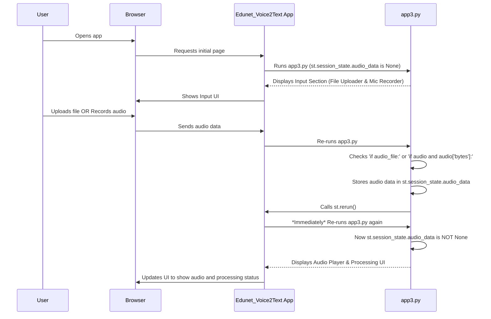

# Chapter 2: Audio Input Handling

Welcome back, future AI application builder! In the previous chapter, [Streamlit Application Framework](01_streamlit_application_framework_.md), we learned how Streamlit helps us create beautiful web applications using just Python. We saw how to display text, organize content into columns, and even add a file uploader widget.

Now, it's time to give our `Edunet_Voice2Text` application its "ears"! This chapter, "Audio Input Handling," is all about how our app *gets* the lecture audio from you, the user, so it can then be processed by the smart AI models.

### Why is Audio Input Handling Important?

Imagine you have an amazing AI that can transcribe lectures, summarize them, and create flashcards. That's super cool! But how does the AI actually *get* the audio of the lecture? It can't just magically hear it.

This is the core problem that **Audio Input Handling** solves. It's the part of our application responsible for:

1.  **Capturing Audio:** Letting you record your voice directly using a microphone.
2.  **Receiving Audio:** Allowing you to upload an existing audio file (like an MP3 or WAV).
3.  **Preparing Audio:** Getting this audio data ready for the next steps, like sending it to the [Speech-to-Text (ASR) Engine](03_speech_to_text__asr__engine_.md).

Think of it like the front desk of a library. Before you can read a book, you first need to bring it to the library or check it out. Audio Input Handling is that front desk, making sure the "book" (your audio) is correctly received and ready for the "librarians" (our AI models) to work on.

### How Edunet_Voice2Text Gets Your Audio

Our `Edunet_Voice2Text` app offers two main ways for you to provide audio: **Live Recording** and **File Upload**. We want to make it easy for you to use either option.

Let's look at the simple Python code that enables this.

#### 1. Uploading an Audio File

This is probably the most common way to get a pre-recorded lecture into the app. Streamlit makes it very straightforward using the `st.file_uploader()` widget we briefly touched upon in Chapter 1.

Here’s the relevant snippet from our `app3.py` file:

```python
# From app3.py
import streamlit as st
# ... (other imports and code) ...

# Create two columns for layout
col1, col2 = st.columns(2)

with col2: # Content for the second column
    st.markdown('<div class="custom-card"><b>📁 File Upload</b><br>WAV, MP3, WEBM, M4A</div>', unsafe_allow_html=True)
    audio_file = st.file_uploader(
        "Upload audio...",
        type=["wav", "mp3", "webm", "m4a"], # Allowed file types
        key="uploader" # Unique identifier for this widget
    )
    if audio_file:
        st.session_state.file_name = audio_file.name
        st.session_state.audio_data = audio_file.read() # Read the file content
        st.success("✅ File uploaded!")
        st.rerun() # Re-run the app to process the uploaded file
```

**What this code does:**

1.  `col1, col2 = st.columns(2)`: We create two columns to arrange our "Live Recording" and "File Upload" sections side-by-side. The file uploader goes into the second column (`with col2:`).
2.  `st.file_uploader("Upload audio...", type=["wav", ...], key="uploader")`: This creates the interactive area where you can drag-and-drop a file or click to browse.
    *   `"Upload audio..."` is the text displayed.
    *   `type=["wav", "mp3", "webm", "m4a"]` tells Streamlit (and your browser) which types of audio files are allowed.
    *   `key="uploader"` is just a unique name for this widget, which helps Streamlit keep track of it, especially when you have multiple widgets.
3.  `if audio_file:`: After you upload a file, the `audio_file` variable will no longer be empty (it will contain information about your file). This `if` statement then runs.
4.  `st.session_state.file_name = audio_file.name` and `st.session_state.audio_data = audio_file.read()`: This is crucial!
    *   `audio_file.name` gets the file's original name.
    *   `audio_file.read()` reads the *entire content* of your audio file as raw bytes (a sequence of 0s and 1s, which is how computers store data).
    *   We store both the `file_name` and the `audio_data` into `st.session_state`. This is Streamlit's way of remembering information across different runs of your script. You can learn more about this in [Session State Management](06_session_state_management_.md).
5.  `st.success("✅ File uploaded!")`: Displays a friendly green message to confirm the upload.
6.  `st.rerun()`: This tells Streamlit to immediately re-run the entire script from the top. This is important because once audio is uploaded, we want the app to switch from showing the input widgets to showing the processing and results section.

**What you see:**

On the right side of the "Input Your Lecture" section, you'll see a box that says "Upload audio..." When you click it and select an audio file, a green "✅ File uploaded!" message appears, and the app then proceeds to the next steps (which we'll cover in future chapters!).

#### 2. Live Recording from a Microphone

What if you want to record your thoughts or a short live lecture segment directly into the app? Streamlit itself doesn't have a built-in "microphone recorder" widget. For this, we use a helpful external library called `streamlit_mic_recorder`.

Let's look at the code for live recording:

```python
# From app3.py
import streamlit as st
from streamlit_mic_recorder import mic_recorder # New import!
# ... (other imports and code) ...

# Create two columns for layout
col1, col2 = st.columns(2)

with col1: # Content for the first column
    st.markdown('<div class="custom-card"><b>🎤 Live Recording</b><br>Record from your microphone</div>', unsafe_allow_html=True)
    audio = mic_recorder(
        "🎙️ Start Recording", # Text for the start button
        "⏹️ Stop",            # Text for the stop button
        format="webm",         # Audio format for recording
        key="recorder"         # Unique identifier
    )
    if audio and audio['bytes']:
        st.session_state.file_name = f"recording_{datetime.now().strftime('%Y%m%d_%H%M%S')}.webm"
        st.session_state.audio_data = audio['bytes'] # Store the recorded audio bytes
        st.success("✅ Recording captured!")
        st.rerun() # Re-run the app to process the recording
```

**What this code does:**

1.  `from streamlit_mic_recorder import mic_recorder`: This line imports the `mic_recorder` function from the library we added.
2.  `mic_recorder("🎙️ Start Recording", "⏹️ Stop", format="webm", key="recorder")`: This creates the microphone recording widget.
    *   It displays two buttons: one to start recording and one to stop.
    *   `format="webm"` specifies the audio format for the recording.
    *   When you stop recording, the recorded audio data is returned and stored in the `audio` variable.
3.  `if audio and audio['bytes']:`: This checks if `audio` contains valid recorded data. The actual audio content is inside `audio['bytes']`.
4.  `st.session_state.file_name = f"recording_{datetime.now().strftime('%Y%m%d_%H%M%S')}.webm"`: We create a unique filename for the recording, including the current date and time.
5.  `st.session_state.audio_data = audio['bytes']`: Similar to file upload, we store the raw bytes of the recorded audio into `st.session_state`.
6.  `st.success("✅ Recording captured!")`: Confirms the successful recording.
7.  `st.rerun()`: Again, we re-run the app to transition to the processing stage.

**What you see:**

On the left side of the "Input Your Lecture" section, you'll see "🎙️ Start Recording" and "⏹️ Stop" buttons. After you record your voice and click "Stop," a green "✅ Recording captured!" message appears, and the app moves on.

### How Audio Input Handling Works Under the Hood (Simplified)

Let's trace what happens from the moment you interact with the audio input section:

1.  **Initial State:** When you first open the app, `st.session_state.audio_data` is `None`. This tells the app to display the "Input Your Lecture" section with both the live recorder and file uploader.
2.  **User Action:** You either click "Upload audio..." and select a file, or you click "🎙️ Start Recording" and then "⏹️ Stop."
3.  **Data Capture:**
    *   **For File Upload:** Streamlit reads your selected audio file and provides its content as `audio_file.read()`.
    *   **For Live Recording:** The `streamlit_mic_recorder` widget captures your microphone input and provides its content as `audio['bytes']`.
4.  **Storing in Session State:** In both cases, this raw audio data (as bytes) is saved into `st.session_state.audio_data`. The original filename or a generated one is saved in `st.session_state.file_name`.
5.  **Triggering Re-run:** The `st.rerun()` command is crucial. It tells Streamlit, "Hey, I've got new important data! Please re-run the entire script *immediately*."
6.  **Switching UI:** When the script re-runs, it now finds that `st.session_state.audio_data` is *not* `None`. This changes which part of the code runs. Instead of showing the input widgets, it now proceeds to show the audio player and the processing steps (like transcription).

Here's a simplified flow diagram:



This sequence illustrates how `st.session_state` and `st.rerun()` work together to create a dynamic user experience, allowing the app to change its display based on user actions.

### Conclusion

In this chapter, you've learned how `Edunet_Voice2Text` becomes the "ears" of your study process. We explored the essential task of "Audio Input Handling," which allows the application to receive lecture audio in two convenient ways:
*   **Uploading pre-recorded files** using Streamlit's `st.file_uploader()`.
*   **Recording live audio** directly from your microphone using the `streamlit_mic_recorder` library.

We also saw how `st.session_state` is used to remember the audio data after it's captured or uploaded, and how `st.rerun()` helps the app smoothly transition to the next stage.

Now that our application can successfully get the audio, the next exciting step is to convert that audio into text. Get ready to dive into the world of AI as we explore the [Speech-to-Text (ASR) Engine](03_speech_to_text__asr__engine_.md)!

[Next Chapter: Speech-to-Text (ASR) Engine](03_speech_to_text__asr__engine_.md)

---

Generated by [AI Codebase Knowledge Builder](https://github.com/The-Pocket/Tutorial-Codebase-Knowledge)