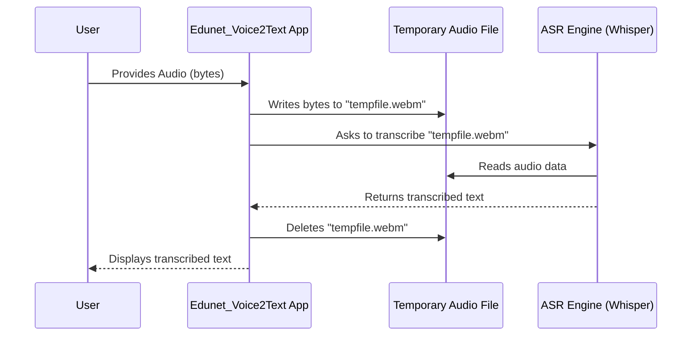

# Chapter 3: Speech-to-Text (ASR) Engine

Welcome back, future AI application builder! In our last chapter, [Audio Input Handling](02_audio_input_handling_.md), our `Edunet_Voice2Text` application grew "ears" and learned how to receive your lecture audio, whether through live recording or file upload. Now that the audio is safely inside our app, what's the very next step to turn a spoken lecture into written notes?

This is where the **Speech-to-Text (ASR) Engine** comes in! This chapter is all about how our application, like a diligent student, "listens" to the audio and "writes down" everything that's being said.

### What Problem Does the Speech-to-Text (ASR) Engine Solve?

Imagine you're in a lecture, and your professor is speaking quickly. You want to capture every word, but typing it all down in real-time is almost impossible. You wish you had a super-efficient assistant who could listen to the lecture and instantly type out a perfect transcript.

This is exactly the problem our **Speech-to-Text (ASR) Engine** solves!

**ASR** stands for **Automatic Speech Recognition**. It's the "listening and typing" brain of our application. It takes the raw audio data (the sound waves from a recorded lecture) and transforms it into written text.

Think of it as a **super-efficient stenographer** who can accurately convert spoken words from a lecture into a clear, readable transcript. This transcript then becomes the foundation for everything else we want to do, like summarizing the text or generating flashcards! Without this step, our AI models wouldn't have any text to work with.

### How Edunet_Voice2Text Uses the ASR Engine

Our `Edunet_Voice2Text` app uses a powerful Artificial Intelligence (AI) model called **Whisper** (developed by OpenAI) to perform this magical conversion from speech to text. We've set it up in a way that's very easy for our app to use.

#### 1. The Transcription Function

The core of our ASR engine is a Python function called `transcribe_with_whisper`. This function is responsible for taking the raw audio data (which we got in Chapter 2) and returning the transcribed text.

Let's look at a simplified version of this function from `app3.py`:

```python
# From app3.py (simplified)
import tempfile
import os
import streamlit as st
import whisper # This is the Speech-to-Text library

@st.cache_resource # This helps the app load the model only once
def load_whisper_model():
    return whisper.load_model("base") # Loads a small, efficient model

def transcribe_with_whisper(audio_bytes):
    # 1. Save audio bytes temporarily
    with tempfile.NamedTemporaryFile(suffix=".webm", delete=False) as f:
        f.write(audio_bytes)
        temp_path = f.name # Get the path to the temporary file

    try:
        # 2. Load the ASR model (fast because of @st.cache_resource)
        model = load_whisper_model()
        # 3. Transcribe the audio file
        result = model.transcribe(temp_path, fp16=False) # 'fp16=False' for broader compatibility
        return result["text"] # The transcribed text is in the 'text' key
    except Exception as e:
        st.error(f"Transcription failed: {e}")
        return None
    finally:
        # 4. Clean up the temporary file
        try: os.remove(temp_path)
        except: pass
```

**What this code does:**

1.  `@st.cache_resource`: This special Streamlit decorator (you can learn more about it in [AI Model Management & Caching](07_ai_model_management___caching_.md)) tells Streamlit to load the `whisper` model only *once* when the application starts, even if the `load_whisper_model()` function is called multiple times. This makes the transcription process much faster.
2.  `tempfile.NamedTemporaryFile()`: The Whisper model needs a physical audio file (like `.mp3` or `.webm`) to work with. Since our app receives audio as raw "bytes" (a stream of data), we first write these bytes into a temporary file on the computer. `delete=False` means we manually delete it later.
3.  `model = load_whisper_model()`: This line gets our pre-loaded Whisper ASR model.
4.  `result = model.transcribe(temp_path, fp16=False)`: This is the magical line! It tells the Whisper model to "listen" to the temporary audio file (`temp_path`) and convert its speech into text. `fp16=False` is a technical setting for compatibility.
5.  `return result["text"]`: The `transcribe` function returns a dictionary, and the actual transcribed text is stored under the `"text"` key, which our function then returns.
6.  `finally: os.remove(temp_path)`: This block ensures that no matter what happens (even if there's an error), the temporary audio file is always deleted to keep our system tidy.

#### 2. Calling the ASR Engine in Our App

After you've uploaded or recorded your audio in the UI (as seen in Chapter 2), the app checks if transcription has already happened. If not, it calls our `transcribe_with_whisper` function.

```python
# From app3.py (simplified)
# ... (inside the else block when st.session_state.audio_data is not None) ...

    # Check if we have already transcribed this audio
    if st.session_state.transcription is None:
        # Show a "processing" message to the user
        with st.spinner("⏳ Processing audio..."):
            # Call our transcription function!
            transcription = transcribe_with_whisper(st.session_state.audio_data)

            # Store the result in session state for later
            st.session_state.transcription = transcription

            if transcription:
                # If transcription was successful, move to the next steps
                # (e.g., summarization, flashcards)
                st.session_state.summary = generate_summary(transcription)
                st.session_state.flashcards = generate_flashcards(transcription)
                st.balloons() # A little celebration!
                st.rerun() # Re-run the app to display results
```

**What this code does:**

1.  `if st.session_state.transcription is None:`: This ensures the transcription only happens once per audio input. We don't want to re-transcribe every time the app re-runs.
2.  `with st.spinner("⏳ Processing audio...")`: While the ASR engine is working (which can take a few moments for longer audio), Streamlit displays a nice spinning animation and a "Processing audio..." message to the user.
3.  `transcription = transcribe_with_whisper(st.session_state.audio_data)`: Here, we finally call our ASR function, passing it the `audio_data` (the raw bytes of your lecture audio) that we saved in [Session State Management](06_session_state_management_.md) during the audio input phase.
4.  `st.session_state.transcription = transcription`: Once the text is returned, we store it in `st.session_state.transcription`. This makes the text available throughout the app's lifetime and prevents re-transcription if the app re-runs.
5.  `if transcription:`: If the transcription was successful, the app then proceeds to other exciting steps like [Text Summarization Engine](04_text_summarization_engine_.md) and [Flashcard Generation (Q&A)](05_flashcard_generation__q_a__.md).
6.  `st.rerun()`: After transcription and setting up subsequent processes, the app re-runs to update the user interface, now showing the results.

**What you see:**

After you've uploaded or recorded your audio, you'll see a spinning circle with "⏳ Processing audio..." message. Once finished, this will be replaced by the full transcription, summary, and flashcards!

### How the ASR Engine Works Under the Hood (Simplified)

Let's trace the journey of your spoken words from audio to text:

1.  **Audio Input:** You, the user, either upload an audio file or record your voice. This provides the `Edunet_Voice2Text` app with raw audio data (a sequence of bytes).
2.  **Temporary Storage:** The app doesn't directly feed these raw bytes into the ASR model. Instead, it temporarily saves these bytes as an actual audio file (e.g., `tempfile.webm`) on your computer's disk.
3.  **Model Loading:** The ASR model (Whisper) is loaded. Thanks to `@st.cache_resource`, this only happens once, making subsequent transcriptions fast.
4.  **Transcription:** The Whisper model "reads" the temporary audio file. Using advanced AI techniques, it analyzes the sound waves, identifies speech patterns, and converts them into text.
5.  **Text Output:** The Whisper model provides the `transcribe_with_whisper` function with the complete, written transcript.
6.  **Cleanup & Display:** The app stores this text in its memory (`st.session_state.transcription`), deletes the temporary audio file, and then updates the webpage to show you the result.

Here’s a simple diagram to visualize this process:



This sequence shows how the app orchestrates the process, using the temporary file as a bridge between the raw audio data and the ASR model.

### Conclusion

In this chapter, you've learned about the crucial role of the **Speech-to-Text (ASR) Engine** in our `Edunet_Voice2Text` application. This "listening and typing" brain, powered by the Whisper AI model, is what transforms raw lecture audio into valuable written text. We explored how the `transcribe_with_whisper` function saves temporary audio, calls the AI model, and then cleans up after itself, all while keeping the user informed with `st.spinner`.

Now that our application can successfully convert spoken words into a detailed transcript, the next logical step is to make that large chunk of text more manageable and digestible. Get ready to condense information as we dive into the [Text Summarization Engine](04_text_summarization_engine_.md)!

[Next Chapter: Text Summarization Engine](04_text_summarization_engine_.md)

---

Generated by [AI Codebase Knowledge Builder](https://github.com/The-Pocket/Tutorial-Codebase-Knowledge)