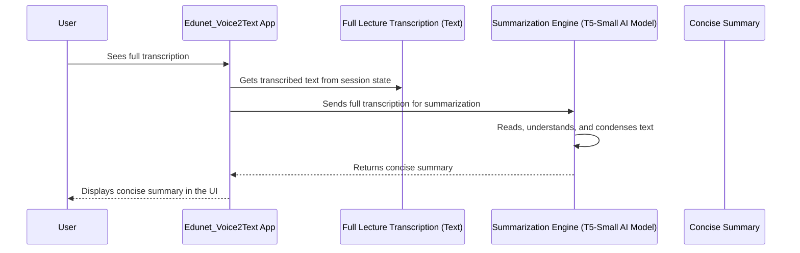

# Chapter 4: Text Summarization Engine

Welcome back! In our previous chapter, [Speech-to-Text (ASR) Engine](03_speech_to_text__asr__engine_.md), our `Edunet_Voice2Text` application learned to "listen" and accurately transcribe your lecture audio into a detailed written text. Now we have a full transcript – great! But sometimes, these transcripts can be very long. Reading through pages of text to find the most important points can still be time-consuming.

This is where the **Text Summarization Engine** comes into play! This chapter will show you how our application acts as your personal "note-taker," distilling lengthy lecture notes into bite-sized summaries.

### What Problem Does the Text Summarization Engine Solve?

Imagine you've just received a 20-page transcript of a two-hour lecture. While having every word is fantastic, you probably don't have time to reread the entire thing before an exam. What you really need are the core ideas, the main arguments, and the key takeaways, presented in a much shorter, easy-to-digest format.

This is exactly the problem our **Text Summarization Engine** solves!

It's like having an AI assistant that can read through your entire lecture transcript, identify the most important information, and then automatically condense it into a concise, easy-to-understand summary. Instead of manually highlighting and note-taking for hours, our engine does it for you in seconds! It turns a "wall of text" into clear, bullet-point-like main ideas.

### How Edunet_Voice2Text Summarizes Your Lecture

Once the [Speech-to-Text (ASR) Engine](03_speech_to_text__asr__engine_.md) has done its job and provided us with the full lecture transcript, our application immediately feeds that text into the summarization engine.

#### 1. The Summarization Function

The core of our summarization feature is a Python function named `generate_summary`. This function takes the long transcription text and hands it over to a specialized AI model designed for summarization.

Let's look at the simplified version of this function and how it's called in `app3.py`:

```python
# From app3.py (simplified - showing the call)
# ... (after transcription is complete) ...
if transcription:
    # Here's where we call the summarization engine!
    st.session_state.summary = generate_summary(transcription)
    # ... then flashcards and rerun ...
    st.rerun()
```

**What this code does:**

1.  `if transcription:`: This checks if the transcription process was successful and we actually have text to summarize.
2.  `st.session_state.summary = generate_summary(transcription)`: This is the important line! We call our `generate_summary` function, passing it the `transcription` text that we got from the ASR engine. The result (the summary) is then stored in `st.session_state.summary`, so the application can remember it. (You can learn more about `st.session_state` in [Session State Management](06_session_state_management_.md)).
3.  `st.rerun()`: After creating the summary (and flashcards), we tell Streamlit to re-run the app to update the display with these new results.

**What you see:**

After the "Processing audio..." spinner disappears, a new section will appear titled "📋 Summary," containing the condensed key points of your lecture.

#### 2. The `generate_summary` Function in Detail

Now, let's peek inside the `generate_summary` function itself. It uses a powerful AI model from a library called `transformers` to perform the summarization.

```python
# From app3.py (simplified, focusing on summary part)
from transformers import pipeline # This library helps us use AI models
import streamlit as st # Needed for st.error and st.cache_resource

@st.cache_resource # Makes sure the model loads only once (more in Chapter 7)
def load_models():
    # This loads a pre-trained AI model specifically designed for summarization.
    # "t5-small" is a small, efficient version of a powerful model.
    summarizer_model = pipeline("summarization", model="t5-small")
    # We return the summarizer model (and a placeholder for another model)
    return summarizer_model, None

def generate_summary(text):
    summarizer, _ = load_models() # Get our summarization tool
    try:
        # Ask the summarizer model to summarize the text.
        # max_length: how long the summary can be (max 150 "tokens" or words).
        # min_length: how short the summary must be (min 40 "tokens").
        # do_sample=False: makes the summary more predictable (less "creative").
        summary_result = summarizer(
            text,
            max_length=150,
            min_length=40,
            do_sample=False
        )
        return summary_result[0]['summary_text'] # Get the actual summary text
    except Exception as e:
        st.error(f"Error during summarization: {e}")
        return None
```

**What this code does:**

1.  `from transformers import pipeline`: We import the `pipeline` tool from the `transformers` library. This tool is super helpful because it makes it easy to use advanced AI models for common tasks like summarization without needing to understand all the complex details.
2.  `@st.cache_resource def load_models():`: This block loads our AI models.
    *   `pipeline("summarization", model="t5-small")`: This is the core of our summarization engine. We tell the `pipeline` to create a "summarization" tool, and we specify which model to use: `"t5-small"`. T5 is a family of powerful AI models, and "t5-small" is a smaller, faster version that works well for many tasks, including summarization. (More on caching models in [AI Model Management & Caching](07_ai_model_management___caching_.md)).
3.  `summarizer(text, max_length=150, min_length=40, do_sample=False)`: When `generate_summary` is called, it uses this `summarizer` tool.
    *   It passes the `text` (your lecture transcript) to the model.
    *   `max_length=150`: This tells the model, "Try not to make the summary longer than 150 'tokens'." A token is often a word or part of a word.
    *   `min_length=40`: This tells the model, "Make sure the summary is at least 40 tokens long, so it's not too short."
    *   `do_sample=False`: This is a technical setting that makes the summarization process more focused on accuracy rather than generating more "creative" or varied outputs.
4.  `summary_result[0]['summary_text']`: The `summarizer` returns a list of dictionaries, and the actual summarized text is found in the `summary_text` key of the first item.

### How the Summarization Engine Works Under the Hood (Simplified)

Let's trace the journey of your transcribed words as they get condensed into a summary:

1.  **Full Transcript Available:** After the ASR engine (Chapter 3) finishes, the entire lecture text is ready.
2.  **AI Model Activation:** The `Edunet_Voice2Text` app sends this full transcript to the `t5-small` AI model, which has been specifically trained on countless examples of text and their summaries.
3.  **Key Information Extraction:** The summarization model doesn't just cut out parts of the text. It intelligently reads through the sentences, understands the context, identifies the most important themes and points, and then either extracts those sentences or, more often, *generates* new sentences that capture the essence of the original text.
4.  **Length Control:** During this process, the model constantly checks the `max_length` and `min_length` settings to ensure the output summary is within the desired word count.
5.  **Concise Summary Output:** The model then produces a new, shorter version of the text containing the main ideas, which our `generate_summary` function returns.
6.  **Display to User:** The app receives this concise summary and displays it on your screen.

Here’s a simple diagram to visualize this process:



This sequence shows how the app orchestrates the summarization, turning a long text into a manageable overview with the help of a smart AI model.

### Conclusion

In this chapter, you've learned how the **Text Summarization Engine** empowers `Edunet_Voice2Text` to act as your intelligent note-taker. We explored how the `generate_summary` function, powered by the `t5-small` AI model through the `transformers` library, condenses lengthy lecture transcripts into short, clear summaries. This crucial step makes reviewing your lectures much faster and more efficient.

Now that we have both the full transcription and a concise summary, what's another great way to study and test your understanding? Flashcards, of course! Get ready to turn your lecture content into interactive study aids as we dive into the [Flashcard Generation (Q&A)](05_flashcard_generation__q_a__.md)!

[Next Chapter: Flashcard Generation (Q&A)](05_flashcard_generation__q_a__.md)

---

Generated by [AI Codebase Knowledge Builder](https://github.com/The-Pocket/Tutorial-Codebase-Knowledge)