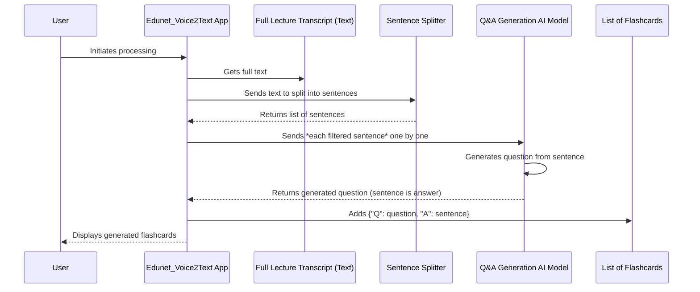

# Chapter 5: Flashcard Generation (Q&A)

Welcome back, future AI application builder! In our last chapter, [Text Summarization Engine](04_text_summarization_engine_.md), our `Edunet_Voice2Text` application became your smart note-taker, condensing lengthy lecture transcripts into concise summaries. Now you have the full text and a quick overview. But what's the best way to really cement that knowledge and check your understanding?

This is where **Flashcard Generation (Q&A)** comes into play! This chapter will show you how our application acts like your personal study assistant, automatically creating helpful question-and-answer flashcards from your lecture content.

### What Problem Does Flashcard Generation (Q&A) Solve?

Imagine you've just finished reviewing a long lecture transcript and its summary. You understand the main points, but you want to *test* yourself. Did you really grasp the details? Can you recall the key definitions and concepts without looking at your notes?

Manually creating flashcards – thinking up questions and then writing down the answers from your notes – can be a time-consuming and tedious task. You could spend hours just preparing your study materials!

This is exactly the problem our **Flashcard Generation (Q&A)** feature solves!

It's like having an **AI tutor** who reads through your entire lecture transcript, understands the important information, and then automatically generates a set of personalized question-and-answer flashcards for you. These flashcards help you quickly quiz yourself, making sure you truly understand the material without the effort of creating them yourself. It transforms your raw lecture notes into an interactive study tool!

### How Edunet_Voice2Text Generates Your Flashcards

Once the [Speech-to-Text (ASR) Engine](03_speech_to_text__asr__engine_.md) has given us the full lecture transcript, and the [Text Summarization Engine](04_text_summarization_engine_.md) has made a summary, our application takes that same full transcript and uses another specialized AI model to create flashcards.

#### 1. Calling the Flashcard Generator

After the audio is transcribed and summarized, the app automatically moves to generating flashcards.

Here's where the flashcard generation function is called in our `app3.py` file:

```python
# From app3.py (simplified - showing the call)
# ... (inside the else block when st.session_state.audio_data is not None) ...

    if st.session_state.transcription is None:
        with st.spinner("⏳ Processing audio..."):
            transcription = transcribe_with_whisper(st.session_state.audio_data)
            st.session_state.transcription = transcription
            if transcription:
                # After transcription and summary, we generate flashcards!
                st.session_state.summary = generate_summary(transcription)
                st.session_state.flashcards = generate_flashcards(transcription) # <-- Here it is!
                st.balloons()
                st.rerun() # Re-run to display results
    # ... (rest of the code to display results) ...
```

**What this code does:**

1.  `if transcription:`: This check ensures that we only try to generate flashcards if we successfully got a lecture transcript.
2.  `st.session_state.flashcards = generate_flashcards(transcription)`: This is the important line! We call our `generate_flashcards` function, passing it the `transcription` text from Chapter 3. The list of created flashcards is then stored in `st.session_state.flashcards`, so the application can remember them. (You can learn more about `st.session_state` in [Session State Management](06_session_state_management_.md)).
3.  `st.rerun()`: After creating the flashcards (and transcription/summary), we tell Streamlit to immediately re-run the app. This updates the display to show you all the new results.

**What you see:**

After the "Processing audio..." spinner disappears, a new section titled "🎯 Study Flashcards" will appear, showing your automatically generated question-and-answer pairs.

#### 2. Displaying the Flashcards

Once the flashcards are generated and stored, our app neatly presents them in the user interface.

```python
# From app3.py (simplified - showing display)
# ... (inside the else block when st.session_state.transcription is not None) ...

        if st.session_state.flashcards: # Check if we have flashcards
            with st.expander("🎯 Study Flashcards", expanded=True): # A clickable section
                for i, card in enumerate(st.session_state.flashcards, 1):
                    st.markdown(f"""
                    <div class="flashcard">
                        <div><b>Card {i}</b></div>
                        <div class="flashcard-question"><strong>Q:</strong> {card['question']}</div>
                        <div class="flashcard-answer"><strong>A:</strong> {card['answer']}</div>
                    </div>
                    """, unsafe_allow_html=True)
                # ... (download buttons for flashcards) ...
```

**What this code does:**

1.  `if st.session_state.flashcards:`: This ensures that the flashcard section only appears if flashcards were successfully generated.
2.  `with st.expander("🎯 Study Flashcards", expanded=True):`: Streamlit's `st.expander` creates a collapsible section. It's like a folder you can open and close. Here, it starts `expanded=True` (open) by default.
3.  `for i, card in enumerate(st.session_state.flashcards, 1):`: This loop goes through each flashcard in our list. `enumerate` helps us get both the card itself and a number (starting from 1) for each card.
4.  `st.markdown(...)`: Inside the loop, for each `card`, we use `st.markdown()` to display its question and answer. We use custom HTML and CSS classes (`flashcard-question`, `flashcard-answer`) to make them look nice, like real study flashcards.

**What you see:**

You'll see a section called "🎯 Study Flashcards" that you can expand or collapse. Inside, each flashcard is displayed with a bold "Q:" for the question and "A:" for the answer, styled distinctly.

### How the Flashcard Generation Engine Works Under the Hood (Simplified)

Let's trace the journey of your transcribed lecture text as it gets transformed into question-and-answer flashcards:

1.  **Full Transcript Available:** After the ASR engine (Chapter 3) finishes, the entire lecture text is ready.
2.  **Sentence Splitting:** The app first breaks down this long text into individual sentences. This is important because flashcards usually consist of a single question and answer.
3.  **Filtering "Good" Sentences:** Not every sentence makes a good flashcard. The app smartly filters these sentences, looking for ones that are neither too short (e.g., "Okay.") nor too long (a whole paragraph), as these are most likely to contain meaningful, summarizable information.
4.  **AI Model Activation (Question Generation):** For each "good" sentence, the app sends it to a special AI model that's been trained specifically to turn statements into questions.
5.  **Q&A Pair Creation:** The AI model generates a question from the sentence. The original sentence then becomes the answer to that question.
6.  **Collecting Flashcards:** The app collects these newly created question-and-answer pairs into a list.
7.  **Display to User:** Finally, the app displays this list of flashcards on your screen for you to use in your study sessions.

Here’s a simple diagram to visualize this process:



#### 3. The `generate_flashcards` Function in Detail

Now, let's look at the actual Python code behind the `generate_flashcards` function. It uses a specialized AI model from the `transformers` library, just like the summarizer.

```python
# From app3.py (simplified, focusing on flashcard generation)
from transformers import pipeline # For using AI models easily
import nltk # Python library for natural language tasks like sentence splitting
import streamlit as st # For st.error, st.cache_resource

@st.cache_resource # Makes sure the AI model loads only once
def load_models():
    # Load a pre-trained AI model specifically for Question Generation.
    # "valhalla/t5-small-qg-hl" is a model designed to turn statements into questions.
    qg_pipe = pipeline("text2text-generation", model="valhalla/t5-small-qg-hl")
    return None, qg_pipe # Returns summarizer as None for this context, and our QG model

def generate_flashcards(text):
    _, qg_pipe = load_models() # Get our Question Generation tool
    sentences = nltk.sent_tokenize(text) # Split the lecture text into individual sentences

    flashcards = []
    # Loop through sentences, but only keep good ones and limit the total
    for s in sentences:
        # We look for sentences between 10 and 50 words long
        if 10 < len(s.split()) < 50:
            try:
                # Ask the AI model to generate a question from the current sentence
                question = qg_pipe(s, max_length=64, do_sample=False)[0]['generated_text']
                # Store the generated question and the original sentence (as answer)
                flashcards.append({"question": question.strip(), "answer": s.strip()})
                if len(flashcards) >= 10: break # Stop after generating 10 flashcards
            except Exception as e:
                # If there's an error with a sentence, skip it and show a message
                st.error(f"Error generating flashcard from sentence: {s[:50]}... Error: {e}")
                continue
    return flashcards
```

**What this code does:**

1.  `from transformers import pipeline` and `import nltk`: We import the `pipeline` tool (from the same `transformers` library used for summarization) and the `nltk` library. `nltk.sent_tokenize` is a powerful function that accurately splits a block of text into individual sentences.
2.  `@st.cache_resource def load_models():`: This block handles loading our AI models.
    *   `pipeline("text2text-generation", model="valhalla/t5-small-qg-hl")`: This is the core of our flashcard generation engine. We create a "text2text-generation" pipeline and specify the model to use: `"valhalla/t5-small-qg-hl"`. This specific AI model has been trained to perform a task called "question generation," meaning it's good at creating questions from given statements. (More on caching models in [AI Model Management & Caching](07_ai_model_management___caching_.md)).
3.  `sentences = nltk.sent_tokenize(text)`: This line takes the full `text` (our lecture transcript) and breaks it into a list of separate sentences.
4.  `if 10 < len(s.split()) < 50:`: This is our "good sentence" filter.
    *   `s.split()` turns the sentence into a list of words.
    *   `len(s.split())` counts the number of words.
    *   We only process sentences that have more than 10 words but fewer than 50 words. This helps us avoid creating flashcards from very short, uninformative phrases or extremely long, complex sentences.
5.  `question = qg_pipe(s, max_length=64, do_sample=False)[0]['generated_text']`: This is where the AI magic happens.
    *   We pass the filtered sentence `s` to our `qg_pipe` (the Question Generation model).
    *   `max_length=64`: Limits the generated question to a reasonable length.
    *   `do_sample=False`: Makes the question generation more direct and less "creative."
    *   The model returns a list, and we extract the actual `generated_text` (the question).
6.  `flashcards.append({"question": question.strip(), "answer": s.strip()})`: We create a dictionary for each flashcard, storing the AI-generated `question` and the `answer` (which is the original sentence).
7.  `if len(flashcards) >= 10: break`: We limit the number of flashcards generated to 10 for demonstration and performance reasons.

This function efficiently takes your lecture transcript, identifies key sentences, and transforms them into useful question-and-answer flashcards, ready for your study sessions.

### Conclusion

In this chapter, you've learned how the **Flashcard Generation (Q&A)** feature turns your `Edunet_Voice2Text` application into an invaluable study assistant. We explored how the `generate_flashcards` function, powered by a specialized AI model from the `transformers` library, automatically creates question-and-answer pairs from your lecture transcripts. This intelligent automation saves you significant time in preparing study materials, allowing you to focus more on learning.

Now that our application can transcribe, summarize, and generate flashcards, it's holding onto a lot of valuable information! But how does Streamlit remember all this data as you interact with the app? Get ready to explore how our application keeps track of everything as we dive into [Session State Management](06_session_state_management_.md)!

[Next Chapter: Session State Management](06_session_state_management_.md)

---

Generated by [AI Codebase Knowledge Builder](https://github.com/The-Pocket/Tutorial-Codebase-Knowledge)