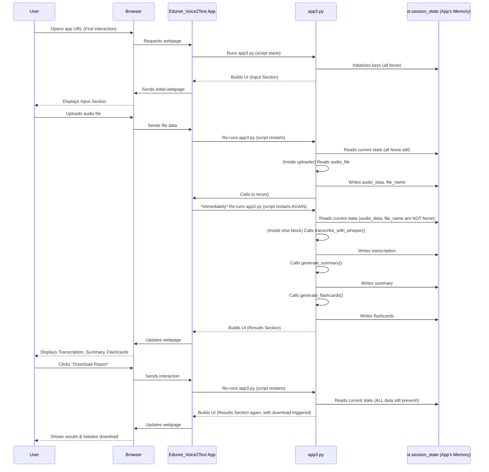

# Chapter 6: Session State Management

Welcome back, future AI application builder! In our last chapter, [Flashcard Generation (Q&A)](05_flashcard_generation__q_a__.md), you learned how `Edunet_Voice2Text` transforms your lecture transcripts into study-ready flashcards. We've seen the app take audio, transcribe it, summarize it, and generate questions and answers. That's a lot of valuable information!

But imagine this: You've just processed a lecture, and you're happily reviewing your summary and flashcards. Then, accidentally, you refresh your browser tab, or you click a button that seems to make the app "reset." Poof! All your generated notes vanish! You'd have to re-upload the audio and wait for everything to process again. That would be incredibly frustrating, right?

This is exactly the problem **Session State Management** solves!

### What Problem Does Session State Management Solve?

Think of our `Edunet_Voice2Text` application as a diligent student taking notes in a digital notebook. When you record audio, transcribe it, summarize it, or generate flashcards, you're essentially adding new notes to this notebook.

However, web applications (and Streamlit apps are no exception) are often designed to "forget" everything with every interaction. Every time you click a button, upload a file, or even just move a slider, Streamlit re-runs your entire Python script from top to bottom (as we discussed in [Streamlit Application Framework](01_streamlit_application_framework_.md)). If your app doesn't have a way to remember things, all the valuable data it generated or received – like your lecture audio, the full transcription, the summary, and the flashcards – would simply disappear after each re-run.

**Session State Management** is like giving your app a **short-term memory** or a **persistent notebook**. It allows the application to remember crucial pieces of information *across* different user actions and page refreshes. This way, your recorded audio, the generated transcription, summary, and flashcards stay put, making your app feel continuous and much more user-friendly.

### What is Streamlit's Session State?

Streamlit provides a special object called `st.session_state` that acts just like a regular Python dictionary. You can store any Python variable in it – numbers, text, lists, dictionaries, even raw audio data.

The key difference is that any data stored in `st.session_state` **persists** as long as the user's browser tab remains open. Even when Streamlit re-runs your script, the values in `st.session_state` are preserved.

Think of `st.session_state` as a whiteboard that belongs to *your specific browser tab*. You can write things on it, erase things, or read things from it. But if someone else opens the app in a different tab, they get their *own* fresh whiteboard.

### How Edunet_Voice2Text Uses Session State

Our `Edunet_Voice2Text` app heavily relies on `st.session_state` to keep track of everything important. Let's see how:

#### 1. Initializing Session State

It's good practice to set up your `st.session_state` variables with default values (like `None` or empty lists) when your app first starts. This ensures they always exist and you don't run into errors if you try to access them before they've been assigned a value.

In `app3.py`, we do this at the very beginning:

```python
# From app3.py
import streamlit as st

# ---- State Management ----
for key in ["audio_data", "file_name", "transcription", "summary", "flashcards"]:
    if key not in st.session_state:
        st.session_state[key] = None
```

**What this code does:**
This `for` loop checks if certain keys (like `"audio_data"`, `"transcription"`, etc.) already exist in `st.session_state`. If a key is *not* found (which happens when the app is first opened or after a full reset), it initializes that key with the value `None`. This ensures that these "memory slots" are always available.

#### 2. Storing Input Data (Audio File/Recording)

When you upload an audio file or record live audio, the app needs to remember that audio data for later processing. This is where `st.session_state` comes in.

Here’s a snippet from the [Audio Input Handling](02_audio_input_handling_.md) chapter:

```python
# From app3.py (simplified - inside file uploader)
# ...
if audio_file:
    st.session_state.file_name = audio_file.name        # Store file name
    st.session_state.audio_data = audio_file.read()     # Store raw audio bytes
    st.success("✅ File uploaded!")
    st.rerun() # Trigger a full re-run to process
```

**What this code does:**
After a file is uploaded, the `audio_file.name` (e.g., "lecture.mp3") and the raw `audio_file.read()` (the actual sound data) are saved into `st.session_state.file_name` and `st.session_state.audio_data`, respectively. Even when `st.rerun()` causes the entire script to restart, these values remain stored in `st.session_state`, so the app doesn't forget your audio!

The same logic applies to live recordings from the microphone.

#### 3. Storing Processed Data (Transcription, Summary, Flashcards)

Once the audio is processed by the AI models, their outputs (the transcription, summary, and flashcards) also need to be stored in `st.session_state`.

From [Speech-to-Text (ASR) Engine](03_speech_to_text__asr__engine_.md):

```python
# From app3.py (simplified - after transcription)
# ...
transcription = transcribe_with_whisper(st.session_state.audio_data)
st.session_state.transcription = transcription # Store the full text!
# ...
```

From [Text Summarization Engine](04_text_summarization_engine_.md):

```python
# From app3.py (simplified - after summarization)
# ...
st.session_state.summary = generate_summary(transcription) # Store the summary!
# ...
```

From [Flashcard Generation (Q&A)](05_flashcard_generation__q_a__.md):

```python
# From app3.py (simplified - after flashcard generation)
# ...
st.session_state.flashcards = generate_flashcards(transcription) # Store the flashcards!
# ...
```

**What these snippets do:**
In each case, after a function completes its task (transcribing, summarizing, or generating flashcards), its result is assigned to a specific key in `st.session_state`. This ensures that these valuable outputs are remembered by the app and are available for display or download, even if the script re-runs.

#### 4. Controlling UI Flow (Showing Different Sections)

`st.session_state` isn't just for storing data; it's also crucial for making the app dynamic. By checking what's *currently* stored in `st.session_state`, the app can decide what to show the user.

For example, our app needs to show the "Input Your Lecture" section only if no audio has been provided yet, and then switch to showing "Analysis Results" once audio is ready.

```python
# From app3.py (simplified)
# ...
if st.session_state.audio_data is None:
    # --- Display Input Widgets (Live Recorder, File Uploader) ---
    st.markdown('<div class="section-header">📥 Input Your Lecture</div>', unsafe_allow_html=True)
    # ... (code for mic_recorder and st.file_uploader) ...

else:
    # --- Display Processing/Results Section ---
    st.markdown(f'<div class="section-header">🔍 Analysis for: {st.session_state.file_name}</div>', unsafe_allow_html=True)
    # ... (code for audio player, transcription, summary, flashcards) ...
```

**What this code does:**
This `if/else` block is a central control point.
*   If `st.session_state.audio_data` is `None` (meaning no audio has been uploaded or recorded yet), the app shows the input widgets.
*   If `st.session_state.audio_data` contains actual audio data (meaning an audio has been provided), the app skips the input widgets and proceeds to display the processing and results sections.

This makes the app's user interface adapt dynamically to the user's actions, all thanks to `st.session_state`.

#### 5. Resetting the Application State

Sometimes, a user wants to start over with a fresh lecture. For this, we need a way to clear all the remembered information from `st.session_state`.

```python
# From app3.py
# ...
def reset_app():
    # Define the keys you want to clear
    keys_to_clear = ["audio_data", "file_name", "transcription", "summary", "flashcards"]
    for key in keys_to_clear:
        if key in st.session_state:
            del st.session_state[key] # Delete the key from session state

# ... later in the UI ...
st.button("🔄 Start Over", on_click=reset_app)
```

**What this code does:**
The `reset_app` function loops through a list of specific `st.session_state` keys and uses `del st.session_state[key]` to remove them. When the "Start Over" button is clicked, this function runs. Removing these keys makes them `None` again, which in turn triggers the `if st.session_state.audio_data is None:` condition, making the app display the input section once more.

### How Session State Works Under the Hood (Simplified)

Let's combine what we learned about Streamlit's re-run model (from Chapter 1) with `st.session_state`.

1.  **First Run (No Audio):**
    *   You open the app.
    *   Streamlit runs `app3.py` from top to bottom.
    *   `st.session_state.audio_data` is `None`.
    *   The app displays the "Input Your Lecture" section (mic recorder, file uploader).

2.  **User Interaction (Uploads Audio):**
    *   You upload an audio file.
    *   Your browser sends the audio data to the Streamlit app.
    *   The `st.file_uploader` widget captures the audio.
    *   The code `st.session_state.audio_data = audio_file.read()` *updates* the value in `st.session_state`.
    *   `st.rerun()` is called.

3.  **Second Run (Audio Present):**
    *   Streamlit *re-runs the entire `app3.py` script from top to bottom, again*.
    *   **Crucially:** When the script starts, `st.session_state.audio_data` *still holds* the audio data you just uploaded (because `st.session_state` preserves its values).
    *   Now, the `if st.session_state.audio_data is None:` check evaluates to `False`.
    *   The app now displays the "Analysis Results" section and begins the transcription process, using the `audio_data` retrieved from `st.session_state`.
    *   As transcription, summarization, and flashcard generation complete, their results are also saved back into `st.session_state`.

4.  **Subsequent Interactions (e.g., downloading report):**
    *   If you click "Download Report," Streamlit re-runs the script.
    *   All the `st.session_state` values (`audio_data`, `transcription`, `summary`, `flashcards`) are still present.
    *   The app quickly checks these values, sees they are all there, and simply re-displays the results without re-processing anything, making the app feel very fast.

Here's a diagram to visualize this "memory" process:



This persistent memory allows Streamlit apps to manage complex workflows and deliver a smooth user experience, even with its unique re-run model.

### Conclusion

In this chapter, you've learned about the critical role of **Session State Management** in our `Edunet_Voice2Text` application. You now understand that `st.session_state` acts as the app's persistent memory, allowing it to remember important data like:
*   Your uploaded audio (`st.session_state.audio_data`, `st.session_state.file_name`).
*   The generated transcription (`st.session_state.transcription`).
*   The summarized text (`st.session_state.summary`).
*   The created flashcards (`st.session_state.flashcards`).

This persistence ensures that your hard-earned results don't vanish with every interaction and that the app can dynamically adapt its display based on the current state of your data.

Now that our application can reliably remember information, the next logical step is to optimize how it loads and manages the large AI models required for transcription, summarization, and flashcard generation. This will make the app faster and more efficient! Get ready to explore how we intelligently handle these powerful AI tools as we dive into [AI Model Management & Caching](07_ai_model_management___caching_.md)!

[Next Chapter: AI Model Management & Caching](07_ai_model_management___caching_.md)

---

Generated by [AI Codebase Knowledge Builder](https://github.com/The-Pocket/Tutorial-Codebase-Knowledge)