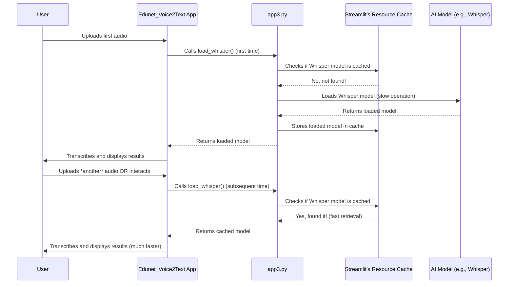

# Chapter 7: AI Model Management & Caching

Welcome back, future AI application builder! In our last chapter, [Session State Management](06_session_state_management_.md), we learned how `st.session_state` gives our `Edunet_Voice2Text` application a "memory" to remember important data like your audio, transcription, summary, and flashcards across different interactions. This ensures your progress isn't lost when the app re-runs.

Now, let's talk about another crucial aspect of making our application fast and efficient: **AI Model Management & Caching**.

### What Problem Does AI Model Management & Caching Solve?

Imagine our AI models for transcription, summarization, and flashcard generation as incredibly **large and heavy textbooks** – perhaps even entire libraries of knowledge. When `Edunet_Voice2Text` needs to transcribe audio or summarize text, it needs to "open" and "read" these massive "books" (AI models).

Loading these AI models into the computer's memory is a **time-consuming and resource-intensive process**. It can take several seconds, or even minutes, especially for larger models.

Recall from [Streamlit Application Framework](01_streamlit_application_framework_.md) that Streamlit re-runs your *entire script* from top to bottom with almost every user interaction. If our app reloaded these huge AI models *every single time* the script re-ran (e.g., after uploading audio, after generating a summary, after clicking a button), the application would be incredibly slow and frustrating to use.

This is exactly the problem **AI Model Management & Caching** solves!

It's like having a **smart librarian** who understands that these "heavy reference books" (AI models) are frequently used. Instead of putting them back on a distant shelf every time and fetching them again, the librarian keeps them on a **special, easily accessible desk**. The next time you need one, it's instantly available, saving a huge amount of time and effort. In our app, this "special desk" is called the **cache**.

### What is `st.cache_resource`?

Streamlit provides a special tool called `@st.cache_resource`. This is Streamlit's built-in "smart librarian" for managing heavy resources like AI models.

When you put `@st.cache_resource` above a Python function, Streamlit does something magical:

1.  **First Call:** The first time that function is called, Streamlit runs it normally. If the function loads an AI model, the model is loaded into memory. Streamlit then "remembers" this loaded model and stores it in its cache.
2.  **Subsequent Calls:** Every time that function is called *again* (during subsequent script re-runs), Streamlit *doesn't actually re-run the code inside the function*. Instead, it simply fetches the already loaded and remembered AI model directly from its cache and returns it instantly.

This means the expensive model loading operation only happens *once* when your app first starts or when the model is first needed. All subsequent operations that require the model get it almost instantly!

### How Edunet_Voice2Text Manages and Caches AI Models

Our `Edunet_Voice2Text` application uses several powerful AI models:

*   **Whisper** for [Speech-to-Text (ASR)](03_speech_to_text__asr__engine_.md).
*   **T5-small** for [Text Summarization](04_text_summarization_engine_.md).
*   **T5-small-qg-hl** for [Flashcard Generation (Q&A)](05_flashcard_generation__q_a__.md).

Let's see how `st.cache_resource` ensures these models are loaded efficiently.

#### 1. Caching the Whisper ASR Model

The Whisper model is typically quite large. Loading it takes time. We want it to load only once.

Here's how we use `st.cache_resource` with the function that loads Whisper:

```python
# From app3.py
import streamlit as st
import whisper # This library is for the Whisper ASR model

@st.cache_resource # <--- The smart librarian!
def load_whisper():
    # This line loads the actual Whisper AI model.
    # It's an expensive operation.
    return whisper.load_model("base")

# ... later, in transcribe_with_whisper function ...
def transcribe_with_whisper(audio_bytes):
    # This calls the load_whisper function.
    # Thanks to @st.cache_resource, it's fast after the first time!
    model = load_whisper()
    # ... use model to transcribe ...
```

**What this code does:**

1.  `@st.cache_resource` is placed directly above the `load_whisper()` function.
2.  When `load_whisper()` is called for the *very first time* (e.g., when you upload your first audio), Streamlit runs `whisper.load_model("base")`, which loads the AI model into memory. Streamlit then remembers this loaded `model` object.
3.  For all *subsequent calls* to `load_whisper()` (e.g., if you upload another audio file, or if the app re-runs for any other reason), Streamlit *skips* the `whisper.load_model("base")` line and simply returns the `model` object it already remembered. This saves a lot of time!

#### 2. Caching the Summarization and Flashcard Models

Similarly, the models for summarization and flashcard generation are also heavy. We manage them in one function.

```python
# From app3.py
import streamlit as st
from transformers import pipeline # For other AI models

@st.cache_resource # <--- Our smart librarian again!
def load_models():
    # Loads the summarization AI model (T5-small)
    summarizer = pipeline("summarization", model="t5-small")
    # Loads the flashcard generation AI model (valhalla/t5-small-qg-hl)
    qg_pipe = pipeline("text2text-generation", model="valhalla/t5-small-qg-hl")
    return summarizer, qg_pipe # Return both loaded models

# ... later, in generate_summary function ...
def generate_summary(text):
    # Gets the cached summarizer model
    summarizer, _ = load_models()
    # ... use summarizer to generate summary ...

# ... later, in generate_flashcards function ...
def generate_flashcards(text):
    # Gets the cached flashcard generation model
    _, qg_pipe = load_models()
    # ... use qg_pipe to generate flashcards ...
```

**What this code does:**

1.  Again, `@st.cache_resource` ensures that the `load_models()` function (which loads two AI models) only executes its internal logic *once*.
2.  The first time `load_models()` is called (e.g., when the app first tries to summarize or generate flashcards), both `summarizer` and `qg_pipe` models are loaded. Streamlit caches both of these.
3.  Any future calls to `load_models()` will simply return the cached, already-loaded models instantly, avoiding redundant and slow loading processes.

**What you see (or rather, what you *don't* see):**

Without caching, you'd notice significant delays (several seconds) every time the app tried to transcribe, summarize, or generate flashcards. With caching, after the *first* time, these operations will feel much snappier because the models are already ready to go. The spin-up time of the app itself is also faster because models are loaded on demand and cached.

### How `st.cache_resource` Works Under the Hood (Simplified)

Let's trace what happens when `load_whisper()` is called in our application:

1.  **App Starts / First Call:**
    *   The `Edunet_Voice2Text` app starts.
    *   Eventually, the `transcribe_with_whisper` function is called for the first time, which in turn calls `load_whisper()`.
    *   Streamlit sees `load_whisper()` has the `@st.cache_resource` decorator.
    *   It checks its internal cache: "Have I run `load_whisper()` before and stored its result?"
    *   Since it's the first time, the answer is "No."
    *   Streamlit then **executes the code inside `load_whisper()`** (`whisper.load_model("base")`). This is the slow part.
    *   Once the model is loaded, Streamlit **stores this loaded `model` object in its cache** and returns it to `transcribe_with_whisper`.

2.  **User Interaction / Subsequent Calls:**
    *   You interact with the app (e.g., click a button to download the summary, which causes a Streamlit re-run, or even upload a *new* audio file).
    *   `transcribe_with_whisper` is called again (or some other part of the script that calls `load_whisper()`).
    *   Streamlit sees `load_whisper()` has `@st.cache_resource`.
    *   It checks its internal cache: "Have I run `load_whisper()` before and stored its result?"
    *   This time, the answer is "Yes!"
    *   Streamlit **immediately retrieves the already loaded `model` object from its cache** and returns it to `transcribe_with_whisper`, without running `whisper.load_model("base")` again. This is super fast!

Here’s a simple diagram to visualize this process:



This intelligent caching mechanism is crucial for ensuring that `Edunet_Voice2Text`, which relies on multiple heavy AI models, remains responsive and efficient, providing a smooth experience for the user.

### Conclusion

In this chapter, you've learned about the vital concept of **AI Model Management & Caching** and how `Edunet_Voice2Text` uses Streamlit's `@st.cache_resource` decorator. You now understand that this "smart librarian" ensures that large AI models (like Whisper for transcription, and T5 models for summarization and flashcards) are loaded only *once*, making your application significantly faster and more efficient by avoiding redundant, time-consuming operations.

We've covered how our app receives audio, processes it with AI to get a transcription, summary, and flashcards, and manages its state and models efficiently. The final piece of the puzzle is how to present all this valuable information to the user in a clear, organized, and downloadable format. Get ready to wrap everything up as we dive into [Output & Report Generation](08_output___report_generation_.md)!

[Next Chapter: Output & Report Generation](08_output___report_generation_.md)

---

Generated by [AI Codebase Knowledge Builder](https://github.com/The-Pocket/Tutorial-Codebase-Knowledge)