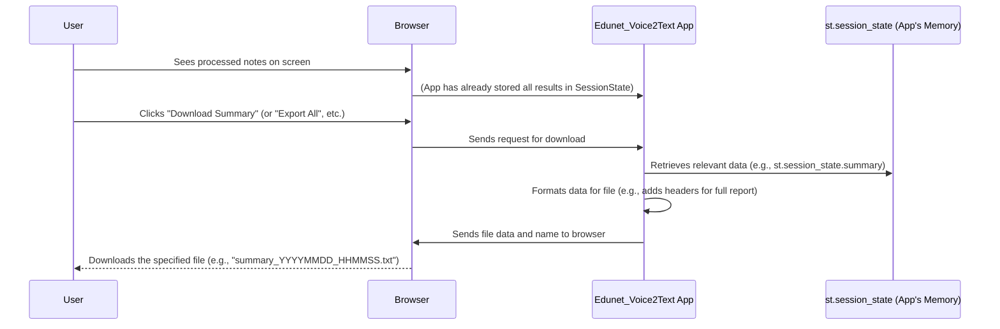

# Chapter 8: Output & Report Generation

Welcome to the grand finale of our `Edunet_Voice2Text` tutorial! In our previous chapter, [AI Model Management & Caching](07_ai_model_management___caching_.md), we learned how to make our powerful AI models load quickly and efficiently, ensuring a smooth experience. Before that, [Session State Management](06_session_state_management_.md) taught us how our app "remembers" all the valuable information it creates.

Now, all the heavy lifting is done! Our app has successfully taken your audio, transcribed it into text, summarized the key points, and even generated study flashcards. But what's the point of all this amazing work if you can't easily *see* it, *save* it, or *share* it?

This is where **Output & Report Generation** comes into play! This chapter is all about presenting your hard-earned lecture notes in a clear, organized way, and making sure you can easily export them for future study.

### What Problem Does Output & Report Generation Solve?

Imagine your `Edunet_Voice2Text` app has just finished processing your two-hour lecture. It now holds a full transcription, a concise summary, and a set of helpful flashcards. That's a lot of useful data!

But if the app just kept this data hidden away, or if it disappeared every time you closed your browser, it wouldn't be very helpful. You need to be able to:
1.  **See the results clearly:** Read the transcription, glance at the summary, and review the flashcards right there on the screen.
2.  **Save individual pieces:** Maybe you only need the summary today, or you want to print just the flashcards.
3.  **Get everything in one go:** For a comprehensive review, you might want a single document containing *all* the generated insights.

**Output & Report Generation** is like the app's **"final presentation and filing system."** It ensures that your insights are not only visible and easy to read but also accessible and exportable. It takes all the intelligence the AI models have generated and puts it into your hands, allowing you to use it however you need for your studies.

### Displaying Your Lecture Insights

First things first: you need to see the results! Our app uses Streamlit's display functions and some custom styling (from [Streamlit Application Framework](01_streamlit_application_framework_.md)) to show the transcription, summary, and flashcards. All this data is retrieved from `st.session_state` (our app's memory, as discussed in [Session State Management](06_session_state_management_.md)).

Let's look at how these results are shown in `app3.py`:

#### 1. Displaying the Full Transcription

The full transcription can be very long, so we put it inside an `st.expander` which allows you to show or hide the content.

```python
# From app3.py
# ... (inside the 'else' block when audio is processed) ...
        with st.expander("📝 Full Transcription"):
            st.markdown(
                f'<div class="transcription-text">{st.session_state.transcription}</div>',
                unsafe_allow_html=True
            )
            # ... download button will go here ...
```

**What this code does:**
*   `with st.expander("📝 Full Transcription"):` creates a collapsible section. You click on "📝 Full Transcription" to expand or collapse it.
*   `st.markdown(...)` displays the actual transcription text. We use an HTML `div` with a custom CSS class (`transcription-text`) to make it look nice, as defined in our app's initial `<style>` block.
*   `st.session_state.transcription` provides the text that was generated by the [Speech-to-Text (ASR) Engine](03_speech_to_text__asr__engine_.md).

**What you see:**
A section titled "📝 Full Transcription" that you can click to reveal or hide the entire lecture transcript.

#### 2. Displaying the Summary

The summary is usually shorter, so it's displayed directly.

```python
# From app3.py
# ... (inside the 'else' block when audio is processed) ...
        if st.session_state.summary:
            st.markdown(
                '<div class="custom-card"><b>📋 Summary</b><br>Key lecture points</div>',
                unsafe_allow_html=True
            )
            st.markdown(
                f'<div class="summary-text">{st.session_state.summary}</div>',
                unsafe_allow_html=True
            )
            # ... download button will go here ...
```

**What this code does:**
*   `if st.session_state.summary:` ensures this section only appears if a summary was successfully generated by the [Text Summarization Engine](04_text_summarization_engine_.md).
*   The first `st.markdown` creates a styled header for the summary.
*   The second `st.markdown` displays the actual summary text, again using a custom CSS class (`summary-text`).

**What you see:**
A clear section labeled "📋 Summary" containing the key points of your lecture.

#### 3. Displaying the Study Flashcards

Flashcards are displayed in their own expandable section, with each card styled to look distinct.

```python
# From app3.py
# ... (inside the 'else' block when audio is processed) ...
        if st.session_state.flashcards:
            with st.expander("🎯 Study Flashcards", expanded=True):
                for i, card in enumerate(st.session_state.flashcards, 1):
                    st.markdown(f"""
                    <div class="flashcard">
                        <div><b>Card {i}</b></div>
                        <div class="flashcard-question"><strong>Q:</strong> {card['question']}</div>
                        <div class="flashcard-answer"><strong>A:</strong> {card['answer']}</div>
                    </div>
                    """, unsafe_allow_html=True)
                # ... download buttons will go here ...
```

**What this code does:**
*   `if st.session_state.flashcards:` checks if flashcards were generated by the [Flashcard Generation (Q&A)](05_flashcard_generation__q_a__.md).
*   `with st.expander("🎯 Study Flashcards", expanded=True):` creates another collapsible section, which is `expanded=True` (open) by default.
*   The `for` loop goes through each `card` in `st.session_state.flashcards`.
*   Inside the loop, `st.markdown` uses more custom HTML and CSS (`flashcard`, `flashcard-question`, `flashcard-answer`) to display each question and answer pair as a styled flashcard.

**What you see:**
An expandable section labeled "🎯 Study Flashcards," showing a list of your question-and-answer pairs, each presented like a physical flashcard.

### Downloading Your Lecture Notes (Individual Files)

Seeing the notes on screen is great, but to truly make them accessible, you need to download them. Streamlit provides a super handy widget for this: `st.download_button()`.

`st.download_button()` needs three main pieces of information:
1.  **Label:** The text on the button (e.g., "Download Summary").
2.  **Data:** The actual content you want to download (e.g., the summary text).
3.  **File Name:** The name of the file that will be saved (e.g., "summary.txt"). You can also specify the file type (like `mime="text/plain"` for plain text or `mime="application/json"` for JSON).

Let's see it in action for each output:

#### 1. Downloading Transcription

```python
# From app3.py
# ... (inside the 'Full Transcription' expander) ...
            st.download_button(
                "📄 Download Transcription",
                st.session_state.transcription,
                f"transcription_{datetime.now().strftime('%Y%m%d_%H%M%S')}.txt"
            )
```

**What this code does:**
*   Creates a button labeled "📄 Download Transcription."
*   When clicked, it downloads the content of `st.session_state.transcription`.
*   The filename is dynamically generated to include the current date and time (e.g., `transcription_20231027_103000.txt`).

#### 2. Downloading Summary

```python
# From app3.py
# ... (after displaying the summary) ...
            st.download_button(
                "📄 Download Summary",
                st.session_state.summary,
                f"summary_{datetime.now().strftime('%Y%m%d_%H%M%S')}.txt"
            )
```

**What this code does:**
Very similar to transcription, this creates a "📄 Download Summary" button that saves the content of `st.session_state.summary` into a dated `.txt` file.

#### 3. Downloading Flashcards (TXT and JSON)

For flashcards, we offer two formats: plain text for easy reading and JSON for more structured use (e.g., if you want to import them into another app).

```python
# From app3.py
# ... (inside the 'Study Flashcards' expander, after displaying cards) ...
                # Prepare flashcards for text download
                flashcard_text = "\n\n".join([f"Q: {c['question']}\nA: {c['answer']}" for c in st.session_state.flashcards])
                # Prepare flashcards for JSON download
                flashcard_json = json.dumps(st.session_state.flashcards, indent=2)

                st.download_button("📄 Flashcards (TXT)", flashcard_text, f"flashcards_{datetime.now().strftime('%Y%m%d_%H%M%S')}.txt")
                st.download_button("📚 Flashcards (JSON)", flashcard_json, f"flashcards_{datetime.now().strftime('%Y%m%d_%H%M%S')}.json")
```

**What this code does:**
*   `flashcard_text = ...`: This line takes our list of flashcard dictionaries and formats them into a single, readable string where each Q&A pair is separated by a blank line.
*   `flashcard_json = json.dumps(...)`: This uses Python's `json` library to convert the list of flashcard dictionaries into a nicely formatted JSON string, which is a common data format for structured data.
*   Two `st.download_button` widgets are created: one for the plain text version and another for the JSON version, each with an appropriate filename.

**What you see:**
Under each section (Transcription, Summary, Flashcards), you'll see a blue "Download" button. For flashcards, you'll see two download options. When you click them, your browser will download the corresponding file.

### Generating a Comprehensive Report

Sometimes, you want *all* your lecture notes and analysis bundled into a single file. Our app provides an "Export All" button for this.

```python
# From app3.py
# ... (after all individual sections and download buttons) ...
        st.markdown("---") # Just a visual separator
        col1, col2 = st.columns([1,1]) # Create two columns for buttons
        with col1: st.button("🔄 Start Over", on_click=reset_app)
        with col2:
            if st.button("📊 Export All"):
                timestamp = datetime.now().strftime("%Y%m%d_%H%M%S")
                full_report = f"""LECTURE ANALYSIS REPORT
File: {st.session_state.file_name}
Generated: {datetime.now().strftime('%Y-%m-%d %H:%M:%S')}

=== TRANSCRIPTION ===
{st.session_state.transcription}

=== SUMMARY ===
{st.session_state.summary or 'No summary'}

=== FLASHCARDS ===
"""
                for i, card in enumerate(st.session_state.flashcards or []):
                    full_report += f"\nCard {i+1}\nQ: {card['question']}\nA: {card['answer']}\n"
                st.download_button("📥 Download Report", full_report, f"lecture_analysis_{timestamp}.txt")
```

**What this code does:**
*   `st.button("📊 Export All")`: Creates the button the user clicks.
*   Inside the `if` block, a `timestamp` is created for a unique filename.
*   A multi-line f-string (`full_report = f"""..."""`) is used to assemble all the content:
    *   It starts with a "LECTURE ANALYSIS REPORT" header.
    *   It includes the original filename (`st.session_state.file_name`) and generation time.
    *   It pulls in the `st.session_state.transcription` and `st.session_state.summary`.
    *   It then loops through `st.session_state.flashcards` (if any exist) and adds each question-answer pair to the report.
*   Finally, `st.download_button` is used to trigger the download of this `full_report` as a single `.txt` file.

**What you see:**
A prominent "📊 Export All" button. Clicking it instantly downloads a single text file containing all the transcription, summary, and flashcards from your lecture analysis.

### How Output & Report Generation Works Under the Hood (Simplified)

Let's trace what happens when you decide to download your lecture notes:

1.  **Data Readiness:** At this stage, all the processed data (transcription, summary, flashcards) is already stored in `st.session_state` (thanks to [Session State Management](06_session_state_management_.md)). This means the app has everything it needs.
2.  **User Interaction:** You click an `st.download_button` (e.g., "Download Summary") or the "Export All" button.
3.  **Streamlit Re-run:** As always, clicking a button triggers Streamlit to re-run the entire `app3.py` script.
4.  **Data Retrieval & Formatting:**
    *   During the re-run, the app checks the conditions for which download button was clicked.
    *   It retrieves the necessary data directly from `st.session_state`.
    *   For flashcards or the full report, it dynamically formats the data into a single string (plain text or JSON) as needed.
5.  **Sending to Browser:** Streamlit takes this prepared data and instructs your web browser to download it as a file with the specified name and type.
6.  **File Download:** Your browser then handles the actual saving of the file to your computer.

Here’s a simple diagram to visualize this process:



This ensures that the valuable insights generated by our AI models are not just transient displays but are enduring, exportable resources for your learning journey.

### Conclusion

Congratulations, future AI application builder! You've reached the end of our `Edunet_Voice2Text` tutorial. In this final chapter, **Output & Report Generation**, you've learned how to present and save all the incredible work our application does. You now understand how to:
*   **Display** the full transcription, concise summary, and interactive flashcards using Streamlit's UI elements and custom styling.
*   **Download individual components** (transcription, summary, flashcards in TXT or JSON) using `st.download_button`.
*   **Generate a comprehensive report** containing all analysis results in a single, easy-to-read text file.

Throughout this journey, you've seen how Streamlit brings together powerful AI models (Whisper, T5) with an intuitive user interface. From handling audio input to generating smart study aids, and finally, making all that information accessible and shareable, `Edunet_Voice2Text` is designed to truly enhance your lecture experience.

This project demonstrates the power of combining modern web frameworks with cutting-edge AI to create practical tools that make learning smarter and more efficient.

Thank you for joining us on this tutorial. We hope you feel empowered to build your own innovative AI applications!

---

Generated by [AI Codebase Knowledge Builder](https://github.com/The-Pocket/Tutorial-Codebase-Knowledge)