# 🎓 Lecture Voice-to-Notes Generator

An intelligent web application built with Streamlit that transforms spoken lectures from audio recordings or live microphone input into structured, easy-to-study notes. The app provides a full transcription, a concise summary, and a set of automatically generated flashcards to aid in learning and revision.

-----

## ✨ Features

  * **Dual Audio Input**:
      * **🎤 Live Recording**: Capture lectures directly in the browser using your microphone.
      * **📁 File Upload**: Process pre-recorded lectures in various formats (`.wav`, `.mp3`, `.webm`, `.m4a`).
  * **AI-Powered Transcription**: Utilizes OpenAI's **Whisper** model for accurate and fast speech-to-text conversion.
  * **Automatic Summarization**: Employs a **T5-small** model to generate a concise summary of the key points from the lecture.
  * **Flashcard Generation**: Creates question-and-answer style flashcards from the transcribed text to facilitate active recall and studying.
  * **Interactive UI**: A clean, modern, and responsive user interface built with Streamlit.
  * **Easy Exporting**: Download the full transcription, summary, flashcards (TXT or JSON), or a complete analysis report.

-----

## 🛠️ Technical Architecture & Workflow

The application follows a sequential data processing pipeline. Once the audio is received, it's transcribed. The resulting text is then used as the input for both the summarization and flashcard generation tasks.

### Core Technologies

This project integrates several libraries and pre-trained language models to achieve its functionality.

| Component                  | Type            | Functionality                                                 |
| -------------------------- | --------------- | ------------------------------------------------------------- |
| **Python** | Language        | The core programming language for the backend logic.          |
| **Streamlit** | Library         | Builds and serves the interactive web user interface.         |
| **`streamlit-mic-recorder`** | Library         | A custom component for capturing live audio from the browser. |
| **`transformers`** | Library         | Provides the `pipeline` API to easily use pre-trained models. |
| **`nltk`** | Library         | Used for Natural Language Processing (NLP), specifically for sentence tokenization. |
| **`openai-whisper`** | LLM (Library)   | A state-of-the-art model for speech-to-text transcription.    |
| **`t5-small`** | LLM             | A Text-to-Text Transfer Transformer model used for summarization. |
| **`valhalla/t5-small-qg-hl`**| LLM             | A fine-tuned T5 model specifically for question generation to create flashcards. |

### Application Workflow Diagram (UML)

This diagram illustrates the flow of data from user input to the final generated notes.

```mermaid
graph TD
    subgraph User Input
        A[🎤 Record Audio] --> C{Audio Data};
        B[📁 Upload Audio File] --> C;
    end

    subgraph Processing Pipeline
        C -- "Temporary File" --> D(Whisper Transcription);
        D -- "Full Text" --> E(Text Summarization);
        D -- "Full Text" --> F(Flashcard Generation);
    end

    subgraph Output
        G[📝 Full Transcription]
        H[📋 Concise Summary]
        I[🎯 Study Flashcards]
    end

    D --> G;
    E --> H;
    F --> I;
```



-----

## 🚀 Getting Started

Follow these instructions to set up and run the project on your local machine.

### 1\. Prerequisites

  * Python 3.8+
  * `pip` package manager
  * (Optional but Recommended) A virtual environment tool like `venv`.

### 2\. Setup and Installation

First, clone the repository and navigate into the project directory.

```bash
git clone <your-repository-url>
cd <repository-name>
```

Next, create and activate a virtual environment. This keeps your project dependencies isolated.

```bash
# Create a virtual environment
python -m venv venv

# Activate it
# On Windows:
venv\Scripts\activate
# On macOS/Linux:
source venv/bin/activate
```

Now, install the required Python packages using the `requirements.txt` file.

```bash
pip install -r requirements.txt
```

*(Note: If you don't have a `requirements.txt` file, create one with the following content: `streamlit`, `streamlit-mic-recorder`, `transformers`, `torch`, `nltk`, `openai-whisper`)*

### 3\. Running the Application

Once the installation is complete, you can launch the Streamlit application with a single command:

```bash
streamlit run app3.py
```

Your web browser should automatically open a new tab with the running application.

-----

## 📖 How to Use

1.  **Provide Audio Input**:
      * Click **"Start Recording"** to record audio live. Click **"Stop"** when finished.
      * Or, use the **"Upload audio..."** section to upload an existing audio file from your computer.
2.  **Processing**:
      * The application will display a spinner indicating that the audio is being processed.
      * Behind the scenes, it performs transcription, summarization, and flashcard generation.
3.  **Review Results**:
      * The results will be displayed in expandable sections: "Full Transcription," "Summary," and "Study Flashcards."
4.  **Export Notes**:
      * Use the download buttons within each section to save the transcription, summary, or flashcards for offline use.
      * Click **"Start Over"** to clear the current results and process a new audio file.
