# Tutorial: Edunet_Voice2Text

This project is an **AI-powered tool** designed to help users efficiently process and study *lecture audio*. It enables users to either **record live audio** or *upload existing audio files*. The application then leverages AI to automatically **transcribe** the spoken content into text, **summarize** the key points, and generate interactive **flashcards** (question-and-answer pairs) for effective learning and review.


**Source Repository:** [https://github.com/Subhapreet21/Edunet_Voice2Text](https://github.com/Subhapreet21/Edunet_Voice2Text)


## Chapters

1. [Streamlit Application Framework
](01_streamlit_application_framework_.md)
2. [Audio Input Handling
](02_audio_input_handling_.md)
3. [Speech-to-Text (ASR) Engine
](03_speech_to_text__asr__engine_.md)
4. [Text Summarization Engine
](04_text_summarization_engine_.md)
5. [Flashcard Generation (Q&A)
](05_flashcard_generation__q_a__.md)
6. [Session State Management
](06_session_state_management_.md)
7. [AI Model Management & Caching
](07_ai_model_management___caching_.md)
8. [Output & Report Generation
](08_output___report_generation_.md)


---

# Chapter 1: Streamlit Application Framework

Welcome to the Edunet_Voice2Text tutorial! In this chapter, we'll start our journey by understanding the very foundation of our application: the "Streamlit Application Framework."

### What Problem Does Streamlit Solve?

Imagine you want to build a cool website application where users can upload an audio file (like a lecture recording), click a button, and then see the transcription, a summary, and even flashcards generated from it. Sounds complex, right? You'd typically need to learn web development languages like HTML (for structure), CSS (for styling), and JavaScript (for interactivity), along with a server-side language.

But what if you're a Python enthusiast and want to quickly turn your data science models or scripts into a beautiful, interactive web app without all that extra hassle? This is exactly where Streamlit shines!

**Streamlit is like your personal "blueprint and construction crew" for building interactive web pages.** It takes your regular Python code and magically transforms it into a functional web application, handling all the complex web development stuff behind the scenes. It defines how everything is displayed on the webpage, from headers and text to buttons and audio players, orchestrating the layout and appearance of all elements.

### Getting Started with Streamlit: The Core Building Blocks

At its heart, Streamlit allows you to use simple Python functions to add elements to your web application. Let's look at the basic ways our Edunet_Voice2Text app uses Streamlit to build its user interface.

#### 1. Displaying Text and Headers

The most basic thing any web app does is show information. Streamlit makes this super easy. You can use functions like `st.title()`, `st.header()`, `st.write()`, or `st.markdown()` to display text, just like you're printing it in your Python console, but now it appears on a webpage!

Our application starts with a welcoming header. In `app3.py`, we use `st.markdown()` to create a custom-styled header:

```python
# From app3.py
import streamlit as st

st.markdown("""
<div class="main-header">
    <h1>🎓 Lecture Voice-to-Notes Generator</h1>
    <p class="subtitle">Transcribe • Summarize • Study smarter with AI</p>
</div>
""", unsafe_allow_html=True)
```

**What this code does:**
The `st.markdown()` function tells Streamlit to display text formatted using Markdown (a simple way to add formatting like bold, italics, and headings) or even raw HTML. Here, we're embedding HTML to create a visually appealing title and subtitle for our application. The `unsafe_allow_html=True` part is necessary when you want to use raw HTML within `st.markdown()`.

**What you see:**
When you run the app, the very first thing you'll see is a large, colored box at the top with "🎓 Lecture Voice-to-Notes Generator" and its subtitle.

#### 2. Adding Interactive Widgets

A web application isn't just about showing text; it's about interacting with the user. Streamlit provides "widgets" for this – things like buttons, sliders, text input fields, and file uploaders.

In our app, we need users to be able to upload an audio file. Streamlit's `st.file_uploader()` widget handles this:

```python
# From app3.py (simplified)
import streamlit as st

st.markdown('<div class="custom-card"><b>📁 File Upload</b><br>WAV, MP3, WEBM, M4A</div>', unsafe_allow_html=True)
audio_file = st.file_uploader("Upload audio...", type=["wav", "mp3", "webm", "m4a"], key="uploader")

if audio_file:
    st.success("✅ File uploaded!")
    # ... further processing will happen here ...
```

**What this code does:**
`st.file_uploader()` creates a button that, when clicked, opens a file browsing window for the user. It also specifies which file types (like `.wav`, `.mp3`) are allowed. If the user uploads a file, the `audio_file` variable will contain information about that file. We then show a success message.

**What you see:**
On the webpage, there will be a section titled "File Upload" with a clickable area that says "Upload audio...". After a file is selected, a green "✅ File uploaded!" message appears.

#### 3. Structuring the Layout

Web applications often need to arrange content in columns, sidebars, or expanders to look organized. Streamlit offers functions to manage this layout.

Our app provides two ways to input audio: live recording or file upload. We want these side-by-side. We use `st.columns()` for this:

```python
# From app3.py (simplified)
import streamlit as st

col1, col2 = st.columns(2) # Create two columns

with col1: # Content inside the first column
    st.markdown('<div class="custom-card"><b>🎤 Live Recording</b><br>Record from your microphone</div>', unsafe_allow_html=True)
    # ... mic recorder widget would go here ...

with col2: # Content inside the second column
    st.markdown('<div class="custom-card"><b>📁 File Upload</b><br>WAV, MP3, WEBM, M4A</div>', unsafe_allow_html=True)
    # ... file uploader widget would go here ...
```

**What this code does:**
`st.columns(2)` creates two equal-width columns. The `with col1:` and `with col2:` blocks ensure that any Streamlit elements (like the markdown text or widgets) placed inside them appear within their respective columns on the webpage.

**What you see:**
You'll see two distinct sections arranged next to each other: one for "Live Recording" and another for "File Upload."

#### 4. Customizing Appearance (Styling)

While `st.markdown()` can take raw HTML, Streamlit also allows you to inject custom CSS (Cascading Style Sheets) to give your app a unique look and feel. CSS is what gives web elements their colors, sizes, fonts, and positions.

Our `app3.py` has a large block of CSS to make the app look modern and dark-themed:

```python
# From app3.py (simplified)
import streamlit as st

st.markdown("""
<style>
    .main-header {
        background: linear-gradient(135deg, #4a148c 0%, #1e3c72 100%);
        padding: 2rem;
        border-radius: 10px;
        text-align: center;
        color: #ffffff;
    }
    .section-header {
        font-size: 1.5rem;
        color: #e0e0e0;
        border-bottom: 3px solid #3498db;
    }
    /* ... many more CSS rules ... */
</style>
""", unsafe_allow_html=True)

# Also, configure the browser tab with st.set_page_config
st.set_page_config(
    page_title="Lecture Voice-to-Notes Generator",
    page_icon="🎓",
    layout="wide",
    initial_sidebar_state="collapsed"
)
```

**What this code does:**
*   The `st.markdown()` block injects a `<style>` tag containing CSS rules. These rules target specific "classes" (like `main-header` or `section-header`) that we've assigned to our HTML elements. For example, `.main-header` defines the background color, padding, and text color for our main app title.
*   `st.set_page_config()` is a special Streamlit function that configures the browser tab. It sets the title (`page_title`), the icon next to the title (`page_icon`), how wide the app content should be (`layout="wide"`), and whether the default Streamlit sidebar is open or closed (`initial_sidebar_state="collapsed"`).

**What you see:**
These CSS rules define the overall dark theme, the gradient background for the main title, the blue borders for section headers, and many other visual details throughout the application. The `set_page_config` ensures your browser tab shows "Lecture Voice-to-Notes Generator" with a graduation cap icon.

### How Streamlit Works: Under the Hood (Simplified)

You might be wondering: "How does my Python script turn into a webpage?"

When you run a Streamlit app (e.g., `streamlit run app3.py`), here's a simplified sequence of events:

1.  **Initial Run**: Streamlit executes your Python script (`app3.py`) from top to bottom. As it encounters `st.` commands (like `st.markdown()`, `st.file_uploader()`), it translates these into web-friendly instructions (HTML, CSS, JavaScript).
2.  **Display**: Streamlit builds an initial webpage based on these instructions and sends it to your web browser.
3.  **Interaction Loop**: The magic happens when you interact with the app (e.g., click a button, upload a file).
    *   Your web browser sends a message back to the Streamlit application.
    *   **Crucially, Streamlit then re-runs your *entire* Python script from top to bottom.** This might sound inefficient, but Streamlit is very smart!
    *   It compares the "new" output of your script with the "old" output and updates only the necessary parts of the webpage, making it feel fast and seamless.

Here's a small diagram to visualize this process:

```mermaid
sequenceDiagram
    participant User
    participant Browser
    participant StreamlitApp as Streamlit App Server
    participant PythonScript as app3.py

    User->>Browser: Opens app URL
    Browser->>StreamlitApp: Requests webpage
    StreamlitApp->>PythonScript: Runs app3.py (first time)
    PythonScript-->>StreamlitApp: Generates web components (header, upload button, etc.)
    StreamlitApp->>Browser: Builds & sends initial webpage
    Browser-->>User: Displays "Lecture Voice-to-Notes Generator"

    User->>Browser: Uploads audio file
    Browser->>StreamlitApp: Sends file data & interaction
    StreamlitApp->>PythonScript: Re-runs app3.py (from top, now with new file data)
    PythonScript-->>StreamlitApp: Updates web components (shows success, hides uploader)
    StreamlitApp->>Browser: Updates relevant parts of webpage
    Browser-->>User: Shows "✅ File uploaded!"
```



This "re-run on interaction" model is fundamental to how Streamlit works and simplifies a lot of web development complexities for you!

### Conclusion

In this chapter, we've introduced Streamlit as the powerful framework that serves as the "blueprint and construction crew" for our Edunet_Voice2Text application. You've learned how simple Python commands allow us to:
*   Display text and headers (`st.markdown()`).
*   Add interactive elements like file uploaders (`st.file_uploader()`).
*   Structure the page layout using columns (`st.columns()`).
*   Customize the app's look and feel with CSS and page configurations (`st.markdown()` with `<style>`, `st.set_page_config()`).

Understanding Streamlit's role is crucial because it's the interface through which users will interact with all the advanced features we're about to build.

---

# Chapter 2: Audio Input Handling

Welcome back, future AI application builder! In the previous chapter, [Streamlit Application Framework](01_streamlit_application_framework_.md), we learned how Streamlit helps us create beautiful web applications using just Python. We saw how to display text, organize content into columns, and even add a file uploader widget.

Now, it's time to give our `Edunet_Voice2Text` application its "ears"! This chapter, "Audio Input Handling," is all about how our app *gets* the lecture audio from you, the user, so it can then be processed by the smart AI models.

### Why is Audio Input Handling Important?

Imagine you have an amazing AI that can transcribe lectures, summarize them, and create flashcards. That's super cool! But how does the AI actually *get* the audio of the lecture? It can't just magically hear it.

This is the core problem that **Audio Input Handling** solves. It's the part of our application responsible for:

1.  **Capturing Audio:** Letting you record your voice directly using a microphone.
2.  **Receiving Audio:** Allowing you to upload an existing audio file (like an MP3 or WAV).
3.  **Preparing Audio:** Getting this audio data ready for the next steps, like sending it to the [Speech-to-Text (ASR) Engine](03_speech_to_text__asr__engine_.md).

Think of it like the front desk of a library. Before you can read a book, you first need to bring it to the library or check it out. Audio Input Handling is that front desk, making sure the "book" (your audio) is correctly received and ready for the "librarians" (our AI models) to work on.

### How Edunet_Voice2Text Gets Your Audio

Our `Edunet_Voice2Text` app offers two main ways for you to provide audio: **Live Recording** and **File Upload**. We want to make it easy for you to use either option.

Let's look at the simple Python code that enables this.

#### 1. Uploading an Audio File

This is probably the most common way to get a pre-recorded lecture into the app. Streamlit makes it very straightforward using the `st.file_uploader()` widget we briefly touched upon in Chapter 1.

Here’s the relevant snippet from our `app3.py` file:

```python
# From app3.py
import streamlit as st
# ... (other imports and code) ...

# Create two columns for layout
col1, col2 = st.columns(2)

with col2: # Content for the second column
    st.markdown('<div class="custom-card"><b>📁 File Upload</b><br>WAV, MP3, WEBM, M4A</div>', unsafe_allow_html=True)
    audio_file = st.file_uploader(
        "Upload audio...",
        type=["wav", "mp3", "webm", "m4a"], # Allowed file types
        key="uploader" # Unique identifier for this widget
    )
    if audio_file:
        st.session_state.file_name = audio_file.name
        st.session_state.audio_data = audio_file.read() # Read the file content
        st.success("✅ File uploaded!")
        st.rerun() # Re-run the app to process the uploaded file
```

**What this code does:**

1.  `col1, col2 = st.columns(2)`: We create two columns to arrange our "Live Recording" and "File Upload" sections side-by-side. The file uploader goes into the second column (`with col2:`).
2.  `st.file_uploader("Upload audio...", type=["wav", ...], key="uploader")`: This creates the interactive area where you can drag-and-drop a file or click to browse.
    *   `"Upload audio..."` is the text displayed.
    *   `type=["wav", "mp3", "webm", "m4a"]` tells Streamlit (and your browser) which types of audio files are allowed.
    *   `key="uploader"` is just a unique name for this widget, which helps Streamlit keep track of it, especially when you have multiple widgets.
3.  `if audio_file:`: After you upload a file, the `audio_file` variable will no longer be empty (it will contain information about your file). This `if` statement then runs.
4.  `st.session_state.file_name = audio_file.name` and `st.session_state.audio_data = audio_file.read()`: This is crucial!
    *   `audio_file.name` gets the file's original name.
    *   `audio_file.read()` reads the *entire content* of your audio file as raw bytes (a sequence of 0s and 1s, which is how computers store data).
    *   We store both the `file_name` and the `audio_data` into `st.session_state`. This is Streamlit's way of remembering information across different runs of your script. You can learn more about this in [Session State Management](06_session_state_management_.md).
5.  `st.success("✅ File uploaded!")`: Displays a friendly green message to confirm the upload.
6.  `st.rerun()`: This tells Streamlit to immediately re-run the entire script from the top. This is important because once audio is uploaded, we want the app to switch from showing the input widgets to showing the processing and results section.

**What you see:**

On the right side of the "Input Your Lecture" section, you'll see a box that says "Upload audio..." When you click it and select an audio file, a green "✅ File uploaded!" message appears, and the app then proceeds to the next steps (which we'll cover in future chapters!).

#### 2. Live Recording from a Microphone

What if you want to record your thoughts or a short live lecture segment directly into the app? Streamlit itself doesn't have a built-in "microphone recorder" widget. For this, we use a helpful external library called `streamlit_mic_recorder`.

Let's look at the code for live recording:

```python
# From app3.py
import streamlit as st
from streamlit_mic_recorder import mic_recorder # New import!
# ... (other imports and code) ...

# Create two columns for layout
col1, col2 = st.columns(2)

with col1: # Content for the first column
    st.markdown('<div class="custom-card"><b>🎤 Live Recording</b><br>Record from your microphone</div>', unsafe_allow_html=True)
    audio = mic_recorder(
        "🎙️ Start Recording", # Text for the start button
        "⏹️ Stop",            # Text for the stop button
        format="webm",         # Audio format for recording
        key="recorder"         # Unique identifier
    )
    if audio and audio['bytes']:
        st.session_state.file_name = f"recording_{datetime.now().strftime('%Y%m%d_%H%M%S')}.webm"
        st.session_state.audio_data = audio['bytes'] # Store the recorded audio bytes
        st.success("✅ Recording captured!")
        st.rerun() # Re-run the app to process the recording
```

**What this code does:**

1.  `from streamlit_mic_recorder import mic_recorder`: This line imports the `mic_recorder` function from the library we added.
2.  `mic_recorder("🎙️ Start Recording", "⏹️ Stop", format="webm", key="recorder")`: This creates the microphone recording widget.
    *   It displays two buttons: one to start recording and one to stop.
    *   `format="webm"` specifies the audio format for the recording.
    *   When you stop recording, the recorded audio data is returned and stored in the `audio` variable.
3.  `if audio and audio['bytes']:`: This checks if `audio` contains valid recorded data. The actual audio content is inside `audio['bytes']`.
4.  `st.session_state.file_name = f"recording_{datetime.now().strftime('%Y%m%d_%H%M%S')}.webm"`: We create a unique filename for the recording, including the current date and time.
5.  `st.session_state.audio_data = audio['bytes']`: Similar to file upload, we store the raw bytes of the recorded audio into `st.session_state`.
6.  `st.success("✅ Recording captured!")`: Confirms the successful recording.
7.  `st.rerun()`: Again, we re-run the app to transition to the processing stage.

**What you see:**

On the left side of the "Input Your Lecture" section, you'll see "🎙️ Start Recording" and "⏹️ Stop" buttons. After you record your voice and click "Stop," a green "✅ Recording captured!" message appears, and the app moves on.

### How Audio Input Handling Works Under the Hood (Simplified)

Let's trace what happens from the moment you interact with the audio input section:

1.  **Initial State:** When you first open the app, `st.session_state.audio_data` is `None`. This tells the app to display the "Input Your Lecture" section with both the live recorder and file uploader.
2.  **User Action:** You either click "Upload audio..." and select a file, or you click "🎙️ Start Recording" and then "⏹️ Stop."
3.  **Data Capture:**
    *   **For File Upload:** Streamlit reads your selected audio file and provides its content as `audio_file.read()`.
    *   **For Live Recording:** The `streamlit_mic_recorder` widget captures your microphone input and provides its content as `audio['bytes']`.
4.  **Storing in Session State:** In both cases, this raw audio data (as bytes) is saved into `st.session_state.audio_data`. The original filename or a generated one is saved in `st.session_state.file_name`.
5.  **Triggering Re-run:** The `st.rerun()` command is crucial. It tells Streamlit, "Hey, I've got new important data! Please re-run the entire script *immediately*."
6.  **Switching UI:** When the script re-runs, it now finds that `st.session_state.audio_data` is *not* `None`. This changes which part of the code runs. Instead of showing the input widgets, it now proceeds to show the audio player and the processing steps (like transcription).

Here's a simplified flow diagram:


This sequence illustrates how `st.session_state` and `st.rerun()` work together to create a dynamic user experience, allowing the app to change its display based on user actions.

### Conclusion

In this chapter, you've learned how `Edunet_Voice2Text` becomes the "ears" of your study process. We explored the essential task of "Audio Input Handling," which allows the application to receive lecture audio in two convenient ways:
*   **Uploading pre-recorded files** using Streamlit's `st.file_uploader()`.
*   **Recording live audio** directly from your microphone using the `streamlit_mic_recorder` library.

We also saw how `st.session_state` is used to remember the audio data after it's captured or uploaded, and how `st.rerun()` helps the app smoothly transition to the next stage.

---

# Chapter 3: Speech-to-Text (ASR) Engine

Welcome back, future AI application builder! In our last chapter, [Audio Input Handling](02_audio_input_handling_.md), our `Edunet_Voice2Text` application grew "ears" and learned how to receive your lecture audio, whether through live recording or file upload. Now that the audio is safely inside our app, what's the very next step to turn a spoken lecture into written notes?

This is where the **Speech-to-Text (ASR) Engine** comes in! This chapter is all about how our application, like a diligent student, "listens" to the audio and "writes down" everything that's being said.

### What Problem Does the Speech-to-Text (ASR) Engine Solve?

Imagine you're in a lecture, and your professor is speaking quickly. You want to capture every word, but typing it all down in real-time is almost impossible. You wish you had a super-efficient assistant who could listen to the lecture and instantly type out a perfect transcript.

This is exactly the problem our **Speech-to-Text (ASR) Engine** solves!

**ASR** stands for **Automatic Speech Recognition**. It's the "listening and typing" brain of our application. It takes the raw audio data (the sound waves from a recorded lecture) and transforms it into written text.

Think of it as a **super-efficient stenographer** who can accurately convert spoken words from a lecture into a clear, readable transcript. This transcript then becomes the foundation for everything else we want to do, like summarizing the text or generating flashcards! Without this step, our AI models wouldn't have any text to work with.

### How Edunet_Voice2Text Uses the ASR Engine

Our `Edunet_Voice2Text` app uses a powerful Artificial Intelligence (AI) model called **Whisper** (developed by OpenAI) to perform this magical conversion from speech to text. We've set it up in a way that's very easy for our app to use.

#### 1. The Transcription Function

The core of our ASR engine is a Python function called `transcribe_with_whisper`. This function is responsible for taking the raw audio data (which we got in Chapter 2) and returning the transcribed text.

Let's look at a simplified version of this function from `app3.py`:

```python
# From app3.py (simplified)
import tempfile
import os
import streamlit as st
import whisper # This is the Speech-to-Text library

@st.cache_resource # This helps the app load the model only once
def load_whisper_model():
    return whisper.load_model("base") # Loads a small, efficient model

def transcribe_with_whisper(audio_bytes):
    # 1. Save audio bytes temporarily
    with tempfile.NamedTemporaryFile(suffix=".webm", delete=False) as f:
        f.write(audio_bytes)
        temp_path = f.name # Get the path to the temporary file

    try:
        # 2. Load the ASR model (fast because of @st.cache_resource)
        model = load_whisper_model()
        # 3. Transcribe the audio file
        result = model.transcribe(temp_path, fp16=False) # 'fp16=False' for broader compatibility
        return result["text"] # The transcribed text is in the 'text' key
    except Exception as e:
        st.error(f"Transcription failed: {e}")
        return None
    finally:
        # 4. Clean up the temporary file
        try: os.remove(temp_path)
        except: pass
```

**What this code does:**

1.  `@st.cache_resource`: This special Streamlit decorator (you can learn more about it in [AI Model Management & Caching](07_ai_model_management___caching_.md)) tells Streamlit to load the `whisper` model only *once* when the application starts, even if the `load_whisper_model()` function is called multiple times. This makes the transcription process much faster.
2.  `tempfile.NamedTemporaryFile()`: The Whisper model needs a physical audio file (like `.mp3` or `.webm`) to work with. Since our app receives audio as raw "bytes" (a stream of data), we first write these bytes into a temporary file on the computer. `delete=False` means we manually delete it later.
3.  `model = load_whisper_model()`: This line gets our pre-loaded Whisper ASR model.
4.  `result = model.transcribe(temp_path, fp16=False)`: This is the magical line! It tells the Whisper model to "listen" to the temporary audio file (`temp_path`) and convert its speech into text. `fp16=False` is a technical setting for compatibility.
5.  `return result["text"]`: The `transcribe` function returns a dictionary, and the actual transcribed text is stored under the `"text"` key, which our function then returns.
6.  `finally: os.remove(temp_path)`: This block ensures that no matter what happens (even if there's an error), the temporary audio file is always deleted to keep our system tidy.

#### 2. Calling the ASR Engine in Our App

After you've uploaded or recorded your audio in the UI (as seen in Chapter 2), the app checks if transcription has already happened. If not, it calls our `transcribe_with_whisper` function.

```python
# From app3.py (simplified)
# ... (inside the else block when st.session_state.audio_data is not None) ...

    # Check if we have already transcribed this audio
    if st.session_state.transcription is None:
        # Show a "processing" message to the user
        with st.spinner("⏳ Processing audio..."):
            # Call our transcription function!
            transcription = transcribe_with_whisper(st.session_state.audio_data)

            # Store the result in session state for later
            st.session_state.transcription = transcription

            if transcription:
                # If transcription was successful, move to the next steps
                # (e.g., summarization, flashcards)
                st.session_state.summary = generate_summary(transcription)
                st.session_state.flashcards = generate_flashcards(transcription)
                st.balloons() # A little celebration!
                st.rerun() # Re-run the app to display results
```

**What this code does:**

1.  `if st.session_state.transcription is None:`: This ensures the transcription only happens once per audio input. We don't want to re-transcribe every time the app re-runs.
2.  `with st.spinner("⏳ Processing audio...")`: While the ASR engine is working (which can take a few moments for longer audio), Streamlit displays a nice spinning animation and a "Processing audio..." message to the user.
3.  `transcription = transcribe_with_whisper(st.session_state.audio_data)`: Here, we finally call our ASR function, passing it the `audio_data` (the raw bytes of your lecture audio) that we saved in [Session State Management](06_session_state_management_.md) during the audio input phase.
4.  `st.session_state.transcription = transcription`: Once the text is returned, we store it in `st.session_state.transcription`. This makes the text available throughout the app's lifetime and prevents re-transcription if the app re-runs.
5.  `if transcription:`: If the transcription was successful, the app then proceeds to other exciting steps like [Text Summarization Engine](04_text_summarization_engine_.md) and [Flashcard Generation (Q&A)](05_flashcard_generation__q_a__.md).
6.  `st.rerun()`: After transcription and setting up subsequent processes, the app re-runs to update the user interface, now showing the results.

**What you see:**

After you've uploaded or recorded your audio, you'll see a spinning circle with "⏳ Processing audio..." message. Once finished, this will be replaced by the full transcription, summary, and flashcards!

### How the ASR Engine Works Under the Hood (Simplified)

Let's trace the journey of your spoken words from audio to text:

1.  **Audio Input:** You, the user, either upload an audio file or record your voice. This provides the `Edunet_Voice2Text` app with raw audio data (a sequence of bytes).
2.  **Temporary Storage:** The app doesn't directly feed these raw bytes into the ASR model. Instead, it temporarily saves these bytes as an actual audio file (e.g., `tempfile.webm`) on your computer's disk.
3.  **Model Loading:** The ASR model (Whisper) is loaded. Thanks to `@st.cache_resource`, this only happens once, making subsequent transcriptions fast.
4.  **Transcription:** The Whisper model "reads" the temporary audio file. Using advanced AI techniques, it analyzes the sound waves, identifies speech patterns, and converts them into text.
5.  **Text Output:** The Whisper model provides the `transcribe_with_whisper` function with the complete, written transcript.
6.  **Cleanup & Display:** The app stores this text in its memory (`st.session_state.transcription`), deletes the temporary audio file, and then updates the webpage to show you the result.

Here’s a simple diagram to visualize this process:


This sequence shows how the app orchestrates the process, using the temporary file as a bridge between the raw audio data and the ASR model.

### Conclusion

In this chapter, you've learned about the crucial role of the **Speech-to-Text (ASR) Engine** in our `Edunet_Voice2Text` application. This "listening and typing" brain, powered by the Whisper AI model, is what transforms raw lecture audio into valuable written text. We explored how the `transcribe_with_whisper` function saves temporary audio, calls the AI model, and then cleans up after itself, all while keeping the user informed with `st.spinner`.

---

# Chapter 4: Text Summarization Engine

Welcome back! In our previous chapter, [Speech-to-Text (ASR) Engine](03_speech_to_text__asr__engine_.md), our `Edunet_Voice2Text` application learned to "listen" and accurately transcribe your lecture audio into a detailed written text. Now we have a full transcript – great! But sometimes, these transcripts can be very long. Reading through pages of text to find the most important points can still be time-consuming.

This is where the **Text Summarization Engine** comes into play! This chapter will show you how our application acts as your personal "note-taker," distilling lengthy lecture notes into bite-sized summaries.

### What Problem Does the Text Summarization Engine Solve?

Imagine you've just received a 20-page transcript of a two-hour lecture. While having every word is fantastic, you probably don't have time to reread the entire thing before an exam. What you really need are the core ideas, the main arguments, and the key takeaways, presented in a much shorter, easy-to-digest format.

This is exactly the problem our **Text Summarization Engine** solves!

It's like having an AI assistant that can read through your entire lecture transcript, identify the most important information, and then automatically condense it into a concise, easy-to-understand summary. Instead of manually highlighting and note-taking for hours, our engine does it for you in seconds! It turns a "wall of text" into clear, bullet-point-like main ideas.

### How Edunet_Voice2Text Summarizes Your Lecture

Once the [Speech-to-Text (ASR) Engine](03_speech_to_text__asr__engine_.md) has done its job and provided us with the full lecture transcript, our application immediately feeds that text into the summarization engine.

#### 1. The Summarization Function

The core of our summarization feature is a Python function named `generate_summary`. This function takes the long transcription text and hands it over to a specialized AI model designed for summarization.

Let's look at the simplified version of this function and how it's called in `app3.py`:

```python
# From app3.py (simplified - showing the call)
# ... (after transcription is complete) ...
if transcription:
    # Here's where we call the summarization engine!
    st.session_state.summary = generate_summary(transcription)
    # ... then flashcards and rerun ...
    st.rerun()
```

**What this code does:**

1.  `if transcription:`: This checks if the transcription process was successful and we actually have text to summarize.
2.  `st.session_state.summary = generate_summary(transcription)`: This is the important line! We call our `generate_summary` function, passing it the `transcription` text that we got from the ASR engine. The result (the summary) is then stored in `st.session_state.summary`, so the application can remember it. (You can learn more about `st.session_state` in [Session State Management](06_session_state_management_.md)).
3.  `st.rerun()`: After creating the summary (and flashcards), we tell Streamlit to re-run the app to update the display with these new results.

**What you see:**

After the "Processing audio..." spinner disappears, a new section will appear titled "📋 Summary," containing the condensed key points of your lecture.

#### 2. The `generate_summary` Function in Detail

Now, let's peek inside the `generate_summary` function itself. It uses a powerful AI model from a library called `transformers` to perform the summarization.

```python
# From app3.py (simplified, focusing on summary part)
from transformers import pipeline # This library helps us use AI models
import streamlit as st # Needed for st.error and st.cache_resource

@st.cache_resource # Makes sure the model loads only once (more in Chapter 7)
def load_models():
    # This loads a pre-trained AI model specifically designed for summarization.
    # "t5-small" is a small, efficient version of a powerful model.
    summarizer_model = pipeline("summarization", model="t5-small")
    # We return the summarizer model (and a placeholder for another model)
    return summarizer_model, None

def generate_summary(text):
    summarizer, _ = load_models() # Get our summarization tool
    try:
        # Ask the summarizer model to summarize the text.
        # max_length: how long the summary can be (max 150 "tokens" or words).
        # min_length: how short the summary must be (min 40 "tokens").
        # do_sample=False: makes the summary more predictable (less "creative").
        summary_result = summarizer(
            text,
            max_length=150,
            min_length=40,
            do_sample=False
        )
        return summary_result[0]['summary_text'] # Get the actual summary text
    except Exception as e:
        st.error(f"Error during summarization: {e}")
        return None
```

**What this code does:**

1.  `from transformers import pipeline`: We import the `pipeline` tool from the `transformers` library. This tool is super helpful because it makes it easy to use advanced AI models for common tasks like summarization without needing to understand all the complex details.
2.  `@st.cache_resource def load_models():`: This block loads our AI models.
    *   `pipeline("summarization", model="t5-small")`: This is the core of our summarization engine. We tell the `pipeline` to create a "summarization" tool, and we specify which model to use: `"t5-small"`. T5 is a family of powerful AI models, and "t5-small" is a smaller, faster version that works well for many tasks, including summarization. (More on caching models in [AI Model Management & Caching](07_ai_model_management___caching_.md)).
3.  `summarizer(text, max_length=150, min_length=40, do_sample=False)`: When `generate_summary` is called, it uses this `summarizer` tool.
    *   It passes the `text` (your lecture transcript) to the model.
    *   `max_length=150`: This tells the model, "Try not to make the summary longer than 150 'tokens'." A token is often a word or part of a word.
    *   `min_length=40`: This tells the model, "Make sure the summary is at least 40 tokens long, so it's not too short."
    *   `do_sample=False`: This is a technical setting that makes the summarization process more focused on accuracy rather than generating more "creative" or varied outputs.
4.  `summary_result[0]['summary_text']`: The `summarizer` returns a list of dictionaries, and the actual summarized text is found in the `summary_text` key of the first item.

### How the Summarization Engine Works Under the Hood (Simplified)

Let's trace the journey of your transcribed words as they get condensed into a summary:

1.  **Full Transcript Available:** After the ASR engine (Chapter 3) finishes, the entire lecture text is ready.
2.  **AI Model Activation:** The `Edunet_Voice2Text` app sends this full transcript to the `t5-small` AI model, which has been specifically trained on countless examples of text and their summaries.
3.  **Key Information Extraction:** The summarization model doesn't just cut out parts of the text. It intelligently reads through the sentences, understands the context, identifies the most important themes and points, and then either extracts those sentences or, more often, *generates* new sentences that capture the essence of the original text.
4.  **Length Control:** During this process, the model constantly checks the `max_length` and `min_length` settings to ensure the output summary is within the desired word count.
5.  **Concise Summary Output:** The model then produces a new, shorter version of the text containing the main ideas, which our `generate_summary` function returns.
6.  **Display to User:** The app receives this concise summary and displays it on your screen.

Here’s a simple diagram to visualize this process:


This sequence shows how the app orchestrates the summarization, turning a long text into a manageable overview with the help of a smart AI model.

### Conclusion

In this chapter, you've learned how the **Text Summarization Engine** empowers `Edunet_Voice2Text` to act as your intelligent note-taker. We explored how the `generate_summary` function, powered by the `t5-small` AI model through the `transformers` library, condenses lengthy lecture transcripts into short, clear summaries. This crucial step makes reviewing your lectures much faster and more efficient.

---

# Chapter 5: Flashcard Generation (Q&A)

Welcome back, future AI application builder! In our last chapter, [Text Summarization Engine](04_text_summarization_engine_.md), our `Edunet_Voice2Text` application became your smart note-taker, condensing lengthy lecture transcripts into concise summaries. Now you have the full text and a quick overview. But what's the best way to really cement that knowledge and check your understanding?

This is where **Flashcard Generation (Q&A)** comes into play! This chapter will show you how our application acts like your personal study assistant, automatically creating helpful question-and-answer flashcards from your lecture content.

### What Problem Does Flashcard Generation (Q&A) Solve?

Imagine you've just finished reviewing a long lecture transcript and its summary. You understand the main points, but you want to *test* yourself. Did you really grasp the details? Can you recall the key definitions and concepts without looking at your notes?

Manually creating flashcards – thinking up questions and then writing down the answers from your notes – can be a time-consuming and tedious task. You could spend hours just preparing your study materials!

This is exactly the problem our **Flashcard Generation (Q&A)** feature solves!

It's like having an **AI tutor** who reads through your entire lecture transcript, understands the important information, and then automatically generates a set of personalized question-and-answer flashcards for you. These flashcards help you quickly quiz yourself, making sure you truly understand the material without the effort of creating them yourself. It transforms your raw lecture notes into an interactive study tool!

### How Edunet_Voice2Text Generates Your Flashcards

Once the [Speech-to-Text (ASR) Engine](03_speech_to_text__asr__engine_.md) has given us the full lecture transcript, and the [Text Summarization Engine](04_text_summarization_engine_.md) has made a summary, our application takes that same full transcript and uses another specialized AI model to create flashcards.

#### 1. Calling the Flashcard Generator

After the audio is transcribed and summarized, the app automatically moves to generating flashcards.

Here's where the flashcard generation function is called in our `app3.py` file:

```python
# From app3.py (simplified - showing the call)
# ... (inside the else block when st.session_state.audio_data is not None) ...

    if st.session_state.transcription is None:
        with st.spinner("⏳ Processing audio..."):
            transcription = transcribe_with_whisper(st.session_state.audio_data)
            st.session_state.transcription = transcription
            if transcription:
                # After transcription and summary, we generate flashcards!
                st.session_state.summary = generate_summary(transcription)
                st.session_state.flashcards = generate_flashcards(transcription) # <-- Here it is!
                st.balloons()
                st.rerun() # Re-run to display results
    # ... (rest of the code to display results) ...
```

**What this code does:**

1.  `if transcription:`: This check ensures that we only try to generate flashcards if we successfully got a lecture transcript.
2.  `st.session_state.flashcards = generate_flashcards(transcription)`: This is the important line! We call our `generate_flashcards` function, passing it the `transcription` text from Chapter 3. The list of created flashcards is then stored in `st.session_state.flashcards`, so the application can remember them. (You can learn more about `st.session_state` in [Session State Management](06_session_state_management_.md)).
3.  `st.rerun()`: After creating the flashcards (and transcription/summary), we tell Streamlit to immediately re-run the app. This updates the display to show you all the new results.

**What you see:**

After the "Processing audio..." spinner disappears, a new section titled "🎯 Study Flashcards" will appear, showing your automatically generated question-and-answer pairs.

#### 2. Displaying the Flashcards

Once the flashcards are generated and stored, our app neatly presents them in the user interface.

```python
# From app3.py (simplified - showing display)
# ... (inside the else block when st.session_state.transcription is not None) ...

        if st.session_state.flashcards: # Check if we have flashcards
            with st.expander("🎯 Study Flashcards", expanded=True): # A clickable section
                for i, card in enumerate(st.session_state.flashcards, 1):
                    st.markdown(f"""
                    <div class="flashcard">
                        <div><b>Card {i}</b></div>
                        <div class="flashcard-question"><strong>Q:</strong> {card['question']}</div>
                        <div class="flashcard-answer"><strong>A:</strong> {card['answer']}</div>
                    </div>
                    """, unsafe_allow_html=True)
                # ... (download buttons for flashcards) ...
```

**What this code does:**

1.  `if st.session_state.flashcards:`: This ensures that the flashcard section only appears if flashcards were successfully generated.
2.  `with st.expander("🎯 Study Flashcards", expanded=True):`: Streamlit's `st.expander` creates a collapsible section. It's like a folder you can open and close. Here, it starts `expanded=True` (open) by default.
3.  `for i, card in enumerate(st.session_state.flashcards, 1):`: This loop goes through each flashcard in our list. `enumerate` helps us get both the card itself and a number (starting from 1) for each card.
4.  `st.markdown(...)`: Inside the loop, for each `card`, we use `st.markdown()` to display its question and answer. We use custom HTML and CSS classes (`flashcard-question`, `flashcard-answer`) to make them look nice, like real study flashcards.

**What you see:**

You'll see a section called "🎯 Study Flashcards" that you can expand or collapse. Inside, each flashcard is displayed with a bold "Q:" for the question and "A:" for the answer, styled distinctly.

### How the Flashcard Generation Engine Works Under the Hood (Simplified)

Let's trace the journey of your transcribed lecture text as it gets transformed into question-and-answer flashcards:

1.  **Full Transcript Available:** After the ASR engine (Chapter 3) finishes, the entire lecture text is ready.
2.  **Sentence Splitting:** The app first breaks down this long text into individual sentences. This is important because flashcards usually consist of a single question and answer.
3.  **Filtering "Good" Sentences:** Not every sentence makes a good flashcard. The app smartly filters these sentences, looking for ones that are neither too short (e.g., "Okay.") nor too long (a whole paragraph), as these are most likely to contain meaningful, summarizable information.
4.  **AI Model Activation (Question Generation):** For each "good" sentence, the app sends it to a special AI model that's been trained specifically to turn statements into questions.
5.  **Q&A Pair Creation:** The AI model generates a question from the sentence. The original sentence then becomes the answer to that question.
6.  **Collecting Flashcards:** The app collects these newly created question-and-answer pairs into a list.
7.  **Display to User:** Finally, the app displays this list of flashcards on your screen for you to use in your study sessions.

Here’s a simple diagram to visualize this process:


#### 3. The `generate_flashcards` Function in Detail

Now, let's look at the actual Python code behind the `generate_flashcards` function. It uses a specialized AI model from the `transformers` library, just like the summarizer.

```python
# From app3.py (simplified, focusing on flashcard generation)
from transformers import pipeline # For using AI models easily
import nltk # Python library for natural language tasks like sentence splitting
import streamlit as st # For st.error, st.cache_resource

@st.cache_resource # Makes sure the AI model loads only once
def load_models():
    # Load a pre-trained AI model specifically for Question Generation.
    # "valhalla/t5-small-qg-hl" is a model designed to turn statements into questions.
    qg_pipe = pipeline("text2text-generation", model="valhalla/t5-small-qg-hl")
    return None, qg_pipe # Returns summarizer as None for this context, and our QG model

def generate_flashcards(text):
    _, qg_pipe = load_models() # Get our Question Generation tool
    sentences = nltk.sent_tokenize(text) # Split the lecture text into individual sentences

    flashcards = []
    # Loop through sentences, but only keep good ones and limit the total
    for s in sentences:
        # We look for sentences between 10 and 50 words long
        if 10 < len(s.split()) < 50:
            try:
                # Ask the AI model to generate a question from the current sentence
                question = qg_pipe(s, max_length=64, do_sample=False)[0]['generated_text']
                # Store the generated question and the original sentence (as answer)
                flashcards.append({"question": question.strip(), "answer": s.strip()})
                if len(flashcards) >= 10: break # Stop after generating 10 flashcards
            except Exception as e:
                # If there's an error with a sentence, skip it and show a message
                st.error(f"Error generating flashcard from sentence: {s[:50]}... Error: {e}")
                continue
    return flashcards
```

**What this code does:**

1.  `from transformers import pipeline` and `import nltk`: We import the `pipeline` tool (from the same `transformers` library used for summarization) and the `nltk` library. `nltk.sent_tokenize` is a powerful function that accurately splits a block of text into individual sentences.
2.  `@st.cache_resource def load_models():`: This block handles loading our AI models.
    *   `pipeline("text2text-generation", model="valhalla/t5-small-qg-hl")`: This is the core of our flashcard generation engine. We create a "text2text-generation" pipeline and specify the model to use: `"valhalla/t5-small-qg-hl"`. This specific AI model has been trained to perform a task called "question generation," meaning it's good at creating questions from given statements. (More on caching models in [AI Model Management & Caching](07_ai_model_management___caching_.md)).
3.  `sentences = nltk.sent_tokenize(text)`: This line takes the full `text` (our lecture transcript) and breaks it into a list of separate sentences.
4.  `if 10 < len(s.split()) < 50:`: This is our "good sentence" filter.
    *   `s.split()` turns the sentence into a list of words.
    *   `len(s.split())` counts the number of words.
    *   We only process sentences that have more than 10 words but fewer than 50 words. This helps us avoid creating flashcards from very short, uninformative phrases or extremely long, complex sentences.
5.  `question = qg_pipe(s, max_length=64, do_sample=False)[0]['generated_text']`: This is where the AI magic happens.
    *   We pass the filtered sentence `s` to our `qg_pipe` (the Question Generation model).
    *   `max_length=64`: Limits the generated question to a reasonable length.
    *   `do_sample=False`: Makes the question generation more direct and less "creative."
    *   The model returns a list, and we extract the actual `generated_text` (the question).
6.  `flashcards.append({"question": question.strip(), "answer": s.strip()})`: We create a dictionary for each flashcard, storing the AI-generated `question` and the `answer` (which is the original sentence).
7.  `if len(flashcards) >= 10: break`: We limit the number of flashcards generated to 10 for demonstration and performance reasons.

This function efficiently takes your lecture transcript, identifies key sentences, and transforms them into useful question-and-answer flashcards, ready for your study sessions.

### Conclusion

In this chapter, you've learned how the **Flashcard Generation (Q&A)** feature turns your `Edunet_Voice2Text` application into an invaluable study assistant. We explored how the `generate_flashcards` function, powered by a specialized AI model from the `transformers` library, automatically creates question-and-answer pairs from your lecture transcripts. This intelligent automation saves you significant time in preparing study materials, allowing you to focus more on learning.

---

# Chapter 6: Session State Management

Welcome back, future AI application builder! In our last chapter, [Flashcard Generation (Q&A)](05_flashcard_generation__q_a__.md), you learned how `Edunet_Voice2Text` transforms your lecture transcripts into study-ready flashcards. We've seen the app take audio, transcribe it, summarize it, and generate questions and answers. That's a lot of valuable information!

But imagine this: You've just processed a lecture, and you're happily reviewing your summary and flashcards. Then, accidentally, you refresh your browser tab, or you click a button that seems to make the app "reset." Poof! All your generated notes vanish! You'd have to re-upload the audio and wait for everything to process again. That would be incredibly frustrating, right?

This is exactly the problem **Session State Management** solves!

### What Problem Does Session State Management Solve?

Think of our `Edunet_Voice2Text` application as a diligent student taking notes in a digital notebook. When you record audio, transcribe it, summarize it, or generate flashcards, you're essentially adding new notes to this notebook.

However, web applications (and Streamlit apps are no exception) are often designed to "forget" everything with every interaction. Every time you click a button, upload a file, or even just move a slider, Streamlit re-runs your entire Python script from top to bottom (as we discussed in [Streamlit Application Framework](01_streamlit_application_framework_.md)). If your app doesn't have a way to remember things, all the valuable data it generated or received – like your lecture audio, the full transcription, the summary, and the flashcards – would simply disappear after each re-run.

**Session State Management** is like giving your app a **short-term memory** or a **persistent notebook**. It allows the application to remember crucial pieces of information *across* different user actions and page refreshes. This way, your recorded audio, the generated transcription, summary, and flashcards stay put, making your app feel continuous and much more user-friendly.

### What is Streamlit's Session State?

Streamlit provides a special object called `st.session_state` that acts just like a regular Python dictionary. You can store any Python variable in it – numbers, text, lists, dictionaries, even raw audio data.

The key difference is that any data stored in `st.session_state` **persists** as long as the user's browser tab remains open. Even when Streamlit re-runs your script, the values in `st.session_state` are preserved.

Think of `st.session_state` as a whiteboard that belongs to *your specific browser tab*. You can write things on it, erase things, or read things from it. But if someone else opens the app in a different tab, they get their *own* fresh whiteboard.

### How Edunet_Voice2Text Uses Session State

Our `Edunet_Voice2Text` app heavily relies on `st.session_state` to keep track of everything important. Let's see how:

#### 1. Initializing Session State

It's good practice to set up your `st.session_state` variables with default values (like `None` or empty lists) when your app first starts. This ensures they always exist and you don't run into errors if you try to access them before they've been assigned a value.

In `app3.py`, we do this at the very beginning:

```python
# From app3.py
import streamlit as st

# ---- State Management ----
for key in ["audio_data", "file_name", "transcription", "summary", "flashcards"]:
    if key not in st.session_state:
        st.session_state[key] = None
```

**What this code does:**
This `for` loop checks if certain keys (like `"audio_data"`, `"transcription"`, etc.) already exist in `st.session_state`. If a key is *not* found (which happens when the app is first opened or after a full reset), it initializes that key with the value `None`. This ensures that these "memory slots" are always available.

#### 2. Storing Input Data (Audio File/Recording)

When you upload an audio file or record live audio, the app needs to remember that audio data for later processing. This is where `st.session_state` comes in.

Here’s a snippet from the [Audio Input Handling](02_audio_input_handling_.md) chapter:

```python
# From app3.py (simplified - inside file uploader)
# ...
if audio_file:
    st.session_state.file_name = audio_file.name        # Store file name
    st.session_state.audio_data = audio_file.read()     # Store raw audio bytes
    st.success("✅ File uploaded!")
    st.rerun() # Trigger a full re-run to process
```

**What this code does:**
After a file is uploaded, the `audio_file.name` (e.g., "lecture.mp3") and the raw `audio_file.read()` (the actual sound data) are saved into `st.session_state.file_name` and `st.session_state.audio_data`, respectively. Even when `st.rerun()` causes the entire script to restart, these values remain stored in `st.session_state`, so the app doesn't forget your audio!

The same logic applies to live recordings from the microphone.

#### 3. Storing Processed Data (Transcription, Summary, Flashcards)

Once the audio is processed by the AI models, their outputs (the transcription, summary, and flashcards) also need to be stored in `st.session_state`.

From [Speech-to-Text (ASR) Engine](03_speech_to_text__asr__engine_.md):

```python
# From app3.py (simplified - after transcription)
# ...
transcription = transcribe_with_whisper(st.session_state.audio_data)
st.session_state.transcription = transcription # Store the full text!
# ...
```

From [Text Summarization Engine](04_text_summarization_engine_.md):

```python
# From app3.py (simplified - after summarization)
# ...
st.session_state.summary = generate_summary(transcription) # Store the summary!
# ...
```

From [Flashcard Generation (Q&A)](05_flashcard_generation__q_a__.md):

```python
# From app3.py (simplified - after flashcard generation)
# ...
st.session_state.flashcards = generate_flashcards(transcription) # Store the flashcards!
# ...
```

**What these snippets do:**
In each case, after a function completes its task (transcribing, summarizing, or generating flashcards), its result is assigned to a specific key in `st.session_state`. This ensures that these valuable outputs are remembered by the app and are available for display or download, even if the script re-runs.

#### 4. Controlling UI Flow (Showing Different Sections)

`st.session_state` isn't just for storing data; it's also crucial for making the app dynamic. By checking what's *currently* stored in `st.session_state`, the app can decide what to show the user.

For example, our app needs to show the "Input Your Lecture" section only if no audio has been provided yet, and then switch to showing "Analysis Results" once audio is ready.

```python
# From app3.py (simplified)
# ...
if st.session_state.audio_data is None:
    # --- Display Input Widgets (Live Recorder, File Uploader) ---
    st.markdown('<div class="section-header">📥 Input Your Lecture</div>', unsafe_allow_html=True)
    # ... (code for mic_recorder and st.file_uploader) ...

else:
    # --- Display Processing/Results Section ---
    st.markdown(f'<div class="section-header">🔍 Analysis for: {st.session_state.file_name}</div>', unsafe_allow_html=True)
    # ... (code for audio player, transcription, summary, flashcards) ...
```

**What this code does:**
This `if/else` block is a central control point.
*   If `st.session_state.audio_data` is `None` (meaning no audio has been uploaded or recorded yet), the app shows the input widgets.
*   If `st.session_state.audio_data` contains actual audio data (meaning an audio has been provided), the app skips the input widgets and proceeds to display the processing and results sections.

This makes the app's user interface adapt dynamically to the user's actions, all thanks to `st.session_state`.

#### 5. Resetting the Application State

Sometimes, a user wants to start over with a fresh lecture. For this, we need a way to clear all the remembered information from `st.session_state`.

```python
# From app3.py
# ...
def reset_app():
    # Define the keys you want to clear
    keys_to_clear = ["audio_data", "file_name", "transcription", "summary", "flashcards"]
    for key in keys_to_clear:
        if key in st.session_state:
            del st.session_state[key] # Delete the key from session state

# ... later in the UI ...
st.button("🔄 Start Over", on_click=reset_app)
```

**What this code does:**
The `reset_app` function loops through a list of specific `st.session_state` keys and uses `del st.session_state[key]` to remove them. When the "Start Over" button is clicked, this function runs. Removing these keys makes them `None` again, which in turn triggers the `if st.session_state.audio_data is None:` condition, making the app display the input section once more.

### How Session State Works Under the Hood (Simplified)

Let's combine what we learned about Streamlit's re-run model (from Chapter 1) with `st.session_state`.

1.  **First Run (No Audio):**
    *   You open the app.
    *   Streamlit runs `app3.py` from top to bottom.
    *   `st.session_state.audio_data` is `None`.
    *   The app displays the "Input Your Lecture" section (mic recorder, file uploader).

2.  **User Interaction (Uploads Audio):**
    *   You upload an audio file.
    *   Your browser sends the audio data to the Streamlit app.
    *   The `st.file_uploader` widget captures the audio.
    *   The code `st.session_state.audio_data = audio_file.read()` *updates* the value in `st.session_state`.
    *   `st.rerun()` is called.

3.  **Second Run (Audio Present):**
    *   Streamlit *re-runs the entire `app3.py` script from top to bottom, again*.
    *   **Crucially:** When the script starts, `st.session_state.audio_data` *still holds* the audio data you just uploaded (because `st.session_state` preserves its values).
    *   Now, the `if st.session_state.audio_data is None:` check evaluates to `False`.
    *   The app now displays the "Analysis Results" section and begins the transcription process, using the `audio_data` retrieved from `st.session_state`.
    *   As transcription, summarization, and flashcard generation complete, their results are also saved back into `st.session_state`.

4.  **Subsequent Interactions (e.g., downloading report):**
    *   If you click "Download Report," Streamlit re-runs the script.
    *   All the `st.session_state` values (`audio_data`, `transcription`, `summary`, `flashcards`) are still present.
    *   The app quickly checks these values, sees they are all there, and simply re-displays the results without re-processing anything, making the app feel very fast.

Here's a diagram to visualize this "memory" process:


This persistent memory allows Streamlit apps to manage complex workflows and deliver a smooth user experience, even with its unique re-run model.

### Conclusion

In this chapter, you've learned about the critical role of **Session State Management** in our `Edunet_Voice2Text` application. You now understand that `st.session_state` acts as the app's persistent memory, allowing it to remember important data like:
*   Your uploaded audio (`st.session_state.audio_data`, `st.session_state.file_name`).
*   The generated transcription (`st.session_state.transcription`).
*   The summarized text (`st.session_state.summary`).
*   The created flashcards (`st.session_state.flashcards`).

This persistence ensures that your hard-earned results don't vanish with every interaction and that the app can dynamically adapt its display based on the current state of your data.

---

# Chapter 7: AI Model Management & Caching

Welcome back, future AI application builder! In our last chapter, [Session State Management](06_session_state_management_.md), we learned how `st.session_state` gives our `Edunet_Voice2Text` application a "memory" to remember important data like your audio, transcription, summary, and flashcards across different interactions. This ensures your progress isn't lost when the app re-runs.

Now, let's talk about another crucial aspect of making our application fast and efficient: **AI Model Management & Caching**.

### What Problem Does AI Model Management & Caching Solve?

Imagine our AI models for transcription, summarization, and flashcard generation as incredibly **large and heavy textbooks** – perhaps even entire libraries of knowledge. When `Edunet_Voice2Text` needs to transcribe audio or summarize text, it needs to "open" and "read" these massive "books" (AI models).

Loading these AI models into the computer's memory is a **time-consuming and resource-intensive process**. It can take several seconds, or even minutes, especially for larger models.

Recall from [Streamlit Application Framework](01_streamlit_application_framework_.md) that Streamlit re-runs your *entire script* from top to bottom with almost every user interaction. If our app reloaded these huge AI models *every single time* the script re-ran (e.g., after uploading audio, after generating a summary, after clicking a button), the application would be incredibly slow and frustrating to use.

This is exactly the problem **AI Model Management & Caching** solves!

It's like having a **smart librarian** who understands that these "heavy reference books" (AI models) are frequently used. Instead of putting them back on a distant shelf every time and fetching them again, the librarian keeps them on a **special, easily accessible desk**. The next time you need one, it's instantly available, saving a huge amount of time and effort. In our app, this "special desk" is called the **cache**.

### What is `st.cache_resource`?

Streamlit provides a special tool called `@st.cache_resource`. This is Streamlit's built-in "smart librarian" for managing heavy resources like AI models.

When you put `@st.cache_resource` above a Python function, Streamlit does something magical:

1.  **First Call:** The first time that function is called, Streamlit runs it normally. If the function loads an AI model, the model is loaded into memory. Streamlit then "remembers" this loaded model and stores it in its cache.
2.  **Subsequent Calls:** Every time that function is called *again* (during subsequent script re-runs), Streamlit *doesn't actually re-run the code inside the function*. Instead, it simply fetches the already loaded and remembered AI model directly from its cache and returns it instantly.

This means the expensive model loading operation only happens *once* when your app first starts or when the model is first needed. All subsequent operations that require the model get it almost instantly!

### How Edunet_Voice2Text Manages and Caches AI Models

Our `Edunet_Voice2Text` application uses several powerful AI models:

*   **Whisper** for [Speech-to-Text (ASR)](03_speech_to_text__asr__engine_.md).
*   **T5-small** for [Text Summarization](04_text_summarization_engine_.md).
*   **T5-small-qg-hl** for [Flashcard Generation (Q&A)](05_flashcard_generation__q_a__.md).

Let's see how `st.cache_resource` ensures these models are loaded efficiently.

#### 1. Caching the Whisper ASR Model

The Whisper model is typically quite large. Loading it takes time. We want it to load only once.

Here's how we use `st.cache_resource` with the function that loads Whisper:

```python
# From app3.py
import streamlit as st
import whisper # This library is for the Whisper ASR model

@st.cache_resource # <--- The smart librarian!
def load_whisper():
    # This line loads the actual Whisper AI model.
    # It's an expensive operation.
    return whisper.load_model("base")

# ... later, in transcribe_with_whisper function ...
def transcribe_with_whisper(audio_bytes):
    # This calls the load_whisper function.
    # Thanks to @st.cache_resource, it's fast after the first time!
    model = load_whisper()
    # ... use model to transcribe ...
```

**What this code does:**

1.  `@st.cache_resource` is placed directly above the `load_whisper()` function.
2.  When `load_whisper()` is called for the *very first time* (e.g., when you upload your first audio), Streamlit runs `whisper.load_model("base")`, which loads the AI model into memory. Streamlit then remembers this loaded `model` object.
3.  For all *subsequent calls* to `load_whisper()` (e.g., if you upload another audio file, or if the app re-runs for any other reason), Streamlit *skips* the `whisper.load_model("base")` line and simply returns the `model` object it already remembered. This saves a lot of time!

#### 2. Caching the Summarization and Flashcard Models

Similarly, the models for summarization and flashcard generation are also heavy. We manage them in one function.

```python
# From app3.py
import streamlit as st
from transformers import pipeline # For other AI models

@st.cache_resource # <--- Our smart librarian again!
def load_models():
    # Loads the summarization AI model (T5-small)
    summarizer = pipeline("summarization", model="t5-small")
    # Loads the flashcard generation AI model (valhalla/t5-small-qg-hl)
    qg_pipe = pipeline("text2text-generation", model="valhalla/t5-small-qg-hl")
    return summarizer, qg_pipe # Return both loaded models

# ... later, in generate_summary function ...
def generate_summary(text):
    # Gets the cached summarizer model
    summarizer, _ = load_models()
    # ... use summarizer to generate summary ...

# ... later, in generate_flashcards function ...
def generate_flashcards(text):
    # Gets the cached flashcard generation model
    _, qg_pipe = load_models()
    # ... use qg_pipe to generate flashcards ...
```

**What this code does:**

1.  Again, `@st.cache_resource` ensures that the `load_models()` function (which loads two AI models) only executes its internal logic *once*.
2.  The first time `load_models()` is called (e.g., when the app first tries to summarize or generate flashcards), both `summarizer` and `qg_pipe` models are loaded. Streamlit caches both of these.
3.  Any future calls to `load_models()` will simply return the cached, already-loaded models instantly, avoiding redundant and slow loading processes.

**What you see (or rather, what you *don't* see):**

Without caching, you'd notice significant delays (several seconds) every time the app tried to transcribe, summarize, or generate flashcards. With caching, after the *first* time, these operations will feel much snappier because the models are already ready to go. The spin-up time of the app itself is also faster because models are loaded on demand and cached.

### How `st.cache_resource` Works Under the Hood (Simplified)

Let's trace what happens when `load_whisper()` is called in our application:

1.  **App Starts / First Call:**
    *   The `Edunet_Voice2Text` app starts.
    *   Eventually, the `transcribe_with_whisper` function is called for the first time, which in turn calls `load_whisper()`.
    *   Streamlit sees `load_whisper()` has the `@st.cache_resource` decorator.
    *   It checks its internal cache: "Have I run `load_whisper()` before and stored its result?"
    *   Since it's the first time, the answer is "No."
    *   Streamlit then **executes the code inside `load_whisper()`** (`whisper.load_model("base")`). This is the slow part.
    *   Once the model is loaded, Streamlit **stores this loaded `model` object in its cache** and returns it to `transcribe_with_whisper`.

2.  **User Interaction / Subsequent Calls:**
    *   You interact with the app (e.g., click a button to download the summary, which causes a Streamlit re-run, or even upload a *new* audio file).
    *   `transcribe_with_whisper` is called again (or some other part of the script that calls `load_whisper()`).
    *   Streamlit sees `load_whisper()` has `@st.cache_resource`.
    *   It checks its internal cache: "Have I run `load_whisper()` before and stored its result?"
    *   This time, the answer is "Yes!"
    *   Streamlit **immediately retrieves the already loaded `model` object from its cache** and returns it to `transcribe_with_whisper`, without running `whisper.load_model("base")` again. This is super fast!

Here’s a simple diagram to visualize this process:


This intelligent caching mechanism is crucial for ensuring that `Edunet_Voice2Text`, which relies on multiple heavy AI models, remains responsive and efficient, providing a smooth experience for the user.

### Conclusion

In this chapter, you've learned about the vital concept of **AI Model Management & Caching** and how `Edunet_Voice2Text` uses Streamlit's `@st.cache_resource` decorator. You now understand that this "smart librarian" ensures that large AI models (like Whisper for transcription, and T5 models for summarization and flashcards) are loaded only *once*, making your application significantly faster and more efficient by avoiding redundant, time-consuming operations.

---

# Chapter 8: Output & Report Generation

Welcome to the grand finale of our `Edunet_Voice2Text` tutorial! In our previous chapter, [AI Model Management & Caching](07_ai_model_management___caching_.md), we learned how to make our powerful AI models load quickly and efficiently, ensuring a smooth experience. Before that, [Session State Management](06_session_state_management_.md) taught us how our app "remembers" all the valuable information it creates.

Now, all the heavy lifting is done! Our app has successfully taken your audio, transcribed it into text, summarized the key points, and even generated study flashcards. But what's the point of all this amazing work if you can't easily *see* it, *save* it, or *share* it?

This is where **Output & Report Generation** comes into play! This chapter is all about presenting your hard-earned lecture notes in a clear, organized way, and making sure you can easily export them for future study.

### What Problem Does Output & Report Generation Solve?

Imagine your `Edunet_Voice2Text` app has just finished processing your two-hour lecture. It now holds a full transcription, a concise summary, and a set of helpful flashcards. That's a lot of useful data!

But if the app just kept this data hidden away, or if it disappeared every time you closed your browser, it wouldn't be very helpful. You need to be able to:
1.  **See the results clearly:** Read the transcription, glance at the summary, and review the flashcards right there on the screen.
2.  **Save individual pieces:** Maybe you only need the summary today, or you want to print just the flashcards.
3.  **Get everything in one go:** For a comprehensive review, you might want a single document containing *all* the generated insights.

**Output & Report Generation** is like the app's **"final presentation and filing system."** It ensures that your insights are not only visible and easy to read but also accessible and exportable. It takes all the intelligence the AI models have generated and puts it into your hands, allowing you to use it however you need for your studies.

### Displaying Your Lecture Insights

First things first: you need to see the results! Our app uses Streamlit's display functions and some custom styling (from [Streamlit Application Framework](01_streamlit_application_framework_.md)) to show the transcription, summary, and flashcards. All this data is retrieved from `st.session_state` (our app's memory, as discussed in [Session State Management](06_session_state_management_.md)).

Let's look at how these results are shown in `app3.py`:

#### 1. Displaying the Full Transcription

The full transcription can be very long, so we put it inside an `st.expander` which allows you to show or hide the content.

```python
# From app3.py
# ... (inside the 'else' block when audio is processed) ...
        with st.expander("📝 Full Transcription"):
            st.markdown(
                f'<div class="transcription-text">{st.session_state.transcription}</div>',
                unsafe_allow_html=True
            )
            # ... download button will go here ...
```

**What this code does:**
*   `with st.expander("📝 Full Transcription"):` creates a collapsible section. You click on "📝 Full Transcription" to expand or collapse it.
*   `st.markdown(...)` displays the actual transcription text. We use an HTML `div` with a custom CSS class (`transcription-text`) to make it look nice, as defined in our app's initial `<style>` block.
*   `st.session_state.transcription` provides the text that was generated by the [Speech-to-Text (ASR) Engine](03_speech_to_text__asr__engine_.md).

**What you see:**
A section titled "📝 Full Transcription" that you can click to reveal or hide the entire lecture transcript.

#### 2. Displaying the Summary

The summary is usually shorter, so it's displayed directly.

```python
# From app3.py
# ... (inside the 'else' block when audio is processed) ...
        if st.session_state.summary:
            st.markdown(
                '<div class="custom-card"><b>📋 Summary</b><br>Key lecture points</div>',
                unsafe_allow_html=True
            )
            st.markdown(
                f'<div class="summary-text">{st.session_state.summary}</div>',
                unsafe_allow_html=True
            )
            # ... download button will go here ...
```

**What this code does:**
*   `if st.session_state.summary:` ensures this section only appears if a summary was successfully generated by the [Text Summarization Engine](04_text_summarization_engine_.md).
*   The first `st.markdown` creates a styled header for the summary.
*   The second `st.markdown` displays the actual summary text, again using a custom CSS class (`summary-text`).

**What you see:**
A clear section labeled "📋 Summary" containing the key points of your lecture.

#### 3. Displaying the Study Flashcards

Flashcards are displayed in their own expandable section, with each card styled to look distinct.

```python
# From app3.py
# ... (inside the 'else' block when audio is processed) ...
        if st.session_state.flashcards:
            with st.expander("🎯 Study Flashcards", expanded=True):
                for i, card in enumerate(st.session_state.flashcards, 1):
                    st.markdown(f"""
                    <div class="flashcard">
                        <div><b>Card {i}</b></div>
                        <div class="flashcard-question"><strong>Q:</strong> {card['question']}</div>
                        <div class="flashcard-answer"><strong>A:</strong> {card['answer']}</div>
                    </div>
                    """, unsafe_allow_html=True)
                # ... download buttons will go here ...
```

**What this code does:**
*   `if st.session_state.flashcards:` checks if flashcards were generated by the [Flashcard Generation (Q&A)](05_flashcard_generation__q_a__.md).
*   `with st.expander("🎯 Study Flashcards", expanded=True):` creates another collapsible section, which is `expanded=True` (open) by default.
*   The `for` loop goes through each `card` in `st.session_state.flashcards`.
*   Inside the loop, `st.markdown` uses more custom HTML and CSS (`flashcard`, `flashcard-question`, `flashcard-answer`) to display each question and answer pair as a styled flashcard.

**What you see:**
An expandable section labeled "🎯 Study Flashcards," showing a list of your question-and-answer pairs, each presented like a physical flashcard.

### Downloading Your Lecture Notes (Individual Files)

Seeing the notes on screen is great, but to truly make them accessible, you need to download them. Streamlit provides a super handy widget for this: `st.download_button()`.

`st.download_button()` needs three main pieces of information:
1.  **Label:** The text on the button (e.g., "Download Summary").
2.  **Data:** The actual content you want to download (e.g., the summary text).
3.  **File Name:** The name of the file that will be saved (e.g., "summary.txt"). You can also specify the file type (like `mime="text/plain"` for plain text or `mime="application/json"` for JSON).

Let's see it in action for each output:

#### 1. Downloading Transcription

```python
# From app3.py
# ... (inside the 'Full Transcription' expander) ...
            st.download_button(
                "📄 Download Transcription",
                st.session_state.transcription,
                f"transcription_{datetime.now().strftime('%Y%m%d_%H%M%S')}.txt"
            )
```

**What this code does:**
*   Creates a button labeled "📄 Download Transcription."
*   When clicked, it downloads the content of `st.session_state.transcription`.
*   The filename is dynamically generated to include the current date and time (e.g., `transcription_20231027_103000.txt`).

#### 2. Downloading Summary

```python
# From app3.py
# ... (after displaying the summary) ...
            st.download_button(
                "📄 Download Summary",
                st.session_state.summary,
                f"summary_{datetime.now().strftime('%Y%m%d_%H%M%S')}.txt"
            )
```

**What this code does:**
Very similar to transcription, this creates a "📄 Download Summary" button that saves the content of `st.session_state.summary` into a dated `.txt` file.

#### 3. Downloading Flashcards (TXT and JSON)

For flashcards, we offer two formats: plain text for easy reading and JSON for more structured use (e.g., if you want to import them into another app).

```python
# From app3.py
# ... (inside the 'Study Flashcards' expander, after displaying cards) ...
                # Prepare flashcards for text download
                flashcard_text = "\n\n".join([f"Q: {c['question']}\nA: {c['answer']}" for c in st.session_state.flashcards])
                # Prepare flashcards for JSON download
                flashcard_json = json.dumps(st.session_state.flashcards, indent=2)

                st.download_button("📄 Flashcards (TXT)", flashcard_text, f"flashcards_{datetime.now().strftime('%Y%m%d_%H%M%S')}.txt")
                st.download_button("📚 Flashcards (JSON)", flashcard_json, f"flashcards_{datetime.now().strftime('%Y%m%d_%H%M%S')}.json")
```

**What this code does:**
*   `flashcard_text = ...`: This line takes our list of flashcard dictionaries and formats them into a single, readable string where each Q&A pair is separated by a blank line.
*   `flashcard_json = json.dumps(...)`: This uses Python's `json` library to convert the list of flashcard dictionaries into a nicely formatted JSON string, which is a common data format for structured data.
*   Two `st.download_button` widgets are created: one for the plain text version and another for the JSON version, each with an appropriate filename.

**What you see:**
Under each section (Transcription, Summary, Flashcards), you'll see a blue "Download" button. For flashcards, you'll see two download options. When you click them, your browser will download the corresponding file.

### Generating a Comprehensive Report

Sometimes, you want *all* your lecture notes and analysis bundled into a single file. Our app provides an "Export All" button for this.

```python
# From app3.py
# ... (after all individual sections and download buttons) ...
        st.markdown("---") # Just a visual separator
        col1, col2 = st.columns([1,1]) # Create two columns for buttons
        with col1: st.button("🔄 Start Over", on_click=reset_app)
        with col2:
            if st.button("📊 Export All"):
                timestamp = datetime.now().strftime("%Y%m%d_%H%M%S")
                full_report = f"""LECTURE ANALYSIS REPORT
File: {st.session_state.file_name}
Generated: {datetime.now().strftime('%Y-%m-%d %H:%M:%S')}

=== TRANSCRIPTION ===
{st.session_state.transcription}

=== SUMMARY ===
{st.session_state.summary or 'No summary'}

=== FLASHCARDS ===
"""
                for i, card in enumerate(st.session_state.flashcards or []):
                    full_report += f"\nCard {i+1}\nQ: {card['question']}\nA: {card['answer']}\n"
                st.download_button("📥 Download Report", full_report, f"lecture_analysis_{timestamp}.txt")
```

**What this code does:**
*   `st.button("📊 Export All")`: Creates the button the user clicks.
*   Inside the `if` block, a `timestamp` is created for a unique filename.
*   A multi-line f-string (`full_report = f"""..."""`) is used to assemble all the content:
    *   It starts with a "LECTURE ANALYSIS REPORT" header.
    *   It includes the original filename (`st.session_state.file_name`) and generation time.
    *   It pulls in the `st.session_state.transcription` and `st.session_state.summary`.
    *   It then loops through `st.session_state.flashcards` (if any exist) and adds each question-answer pair to the report.
*   Finally, `st.download_button` is used to trigger the download of this `full_report` as a single `.txt` file.

**What you see:**
A prominent "📊 Export All" button. Clicking it instantly downloads a single text file containing all the transcription, summary, and flashcards from your lecture analysis.

### How Output & Report Generation Works Under the Hood (Simplified)

Let's trace what happens when you decide to download your lecture notes:

1.  **Data Readiness:** At this stage, all the processed data (transcription, summary, flashcards) is already stored in `st.session_state` (thanks to [Session State Management](06_session_state_management_.md)). This means the app has everything it needs.
2.  **User Interaction:** You click an `st.download_button` (e.g., "Download Summary") or the "Export All" button.
3.  **Streamlit Re-run:** As always, clicking a button triggers Streamlit to re-run the entire `app3.py` script.
4.  **Data Retrieval & Formatting:**
    *   During the re-run, the app checks the conditions for which download button was clicked.
    *   It retrieves the necessary data directly from `st.session_state`.
    *   For flashcards or the full report, it dynamically formats the data into a single string (plain text or JSON) as needed.
5.  **Sending to Browser:** Streamlit takes this prepared data and instructs your web browser to download it as a file with the specified name and type.
6.  **File Download:** Your browser then handles the actual saving of the file to your computer.

Here’s a simple diagram to visualize this process:


This ensures that the valuable insights generated by our AI models are not just transient displays but are enduring, exportable resources for your learning journey.

### Conclusion

This project demonstrates the power of combining modern web frameworks with cutting-edge AI to create practical tools that make learning smarter and more efficient.
