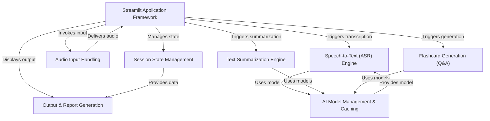

# Tutorial: Edunet_Voice2Text

This project is an **AI-powered tool** designed to help users efficiently process and study *lecture audio*. It enables users to either **record live audio** or *upload existing audio files*. The application then leverages AI to automatically **transcribe** the spoken content into text, **summarize** the key points, and generate interactive **flashcards** (question-and-answer pairs) for effective learning and review.

**Source Repository:** [https://github.com/Subhapreet21/Edunet_Voice2Text](https://github.com/Subhapreet21/Edunet_Voice2Text)

## Chapters

1. [Streamlit Application Framework
](01_streamlit_application_framework_.md)
2. [Audio Input Handling
](02_audio_input_handling_.md)
3. [Speech-to-Text (ASR) Engine
](03_speech_to_text__asr__engine_.md)
4. [Text Summarization Engine
](04_text_summarization_engine_.md)
5. [Flashcard Generation (Q&A)
](05_flashcard_generation__q_a__.md)
6. [Session State Management
](06_session_state_management_.md)
7. [AI Model Management & Caching
](07_ai_model_management___caching_.md)
8. [Output & Report Generation
](08_output___report_generation_.md)

---

Generated by [AI Codebase Knowledge Builder](https://github.com/The-Pocket/Tutorial-Codebase-Knowledge)